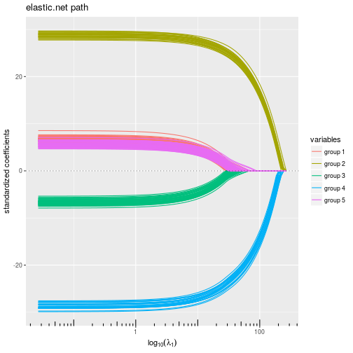

# quadrupen: Sparsity by Worst-Case Quadratic Penalties

## Description

Fits classical sparse regression models with efficient active set
algorithms by solving quadratic problems. Also provides a few methods
for model selection purpose (cross-validation, stability selection).

## Installation


```r
devtools::install_github("jchiquet/quadrupen").
```

Many examples and demos can be found in the `inst` repositories.  Here is a more illustraive one: 

## Example: structured penalized regression

This example is extracted form chapter 1 of my [habilitation](https://tel.archives-ouvertes.fr/tel-01288976/). You can get more insight by reading pages 65-66, 70-71. 

Ok first load the package


```r
library(quadrupen)
```

### A toy data set advocating for structured regularization

See pages 29--30 in my [habilitation](https://tel.archives-ouvertes.fr/tel-01288976/). COde for additional funciton is given by the end of the present document (Appendix).


We draw data from linear regression where the regression parameters are defined groupwise. The corresponding regression correlated according to the same pattern.

```r
n <- 200
p <- 192

## model settings: block wise
mu <- 0
group <- c(p/4,p/8,p/4,p/8,p/4)
label <- factor(rep(paste("group", 1:5), group))
beta <- rep(c(0.25,1,-0.25,-1,0.25), group)
x <- rPred.block(n, p, sizes = group, rho=c(0.25, 0.75, 0.25, 0.75, 0.25))
```

Indeed, the correlation structure between the regressor exhibitis a strong pattern:


We draw the reponse variable by fixing the variance of the noise ratio to get an $R^2$ equal to $0.8$.

```r
dat <- rlm(x,beta,mu,r2=0.8)
```

```
## Warning in rnorm(n) * sigma: Recycling array of length 1 in vector-array arithmetic is deprecated.
##   Use c() or as.vector() instead.
```

```r
y <- dat$y
sigma <- dat$sigma
```

### Regularization without prior knowledge

No we try the available penalized regression method in `quadrupen` to fit the regularization path to this data set

#### Ridge regression  ($\ell_2$ penalty)


```r
plot(ridge(x,y, intercept=FALSE), label=label)
```


#### Lasso  ($\ell_1$ penalty)


```r
plot(lasso(x,y, intercept=FALSE), label=label)
```


#### Elastic-net  ($\ell_1+\ell_2$ penalty)


```r
plot(elastic.net(x,y, lambda2=1, intercept=FALSE), label=label)
```


#### Bounded regression ($\ell_\infty$ penalty)


```r
plot(bounded.reg(x,y, lambda2=0, intercept=FALSE), label=label)
```


#### Ridge + Bounded regression ($\ell_\infty+\ell_2$ penalty)


```r
plot(bounded.reg(x,y, lambda2=5, intercept=FALSE), label=label)
```


### Regularization with prior knowledge

Now let use define the graph associated with the groups of the regressor and compute the Graph Laplacian. We add a small value on the diagonal ton ensure strict positive definiteness (in he futre, this matrix should preferentially be defined with a graph).


```r
A <- bdiag(lapply(group, function(s) matrix(1,s,s))) ; diag(A) <- 0
L <- -A; diag(L) <- colSums(A) + 1e-2
```

Now, we run all the method having a ridge-like regularization by replacing the ridge penalty $\| \code \|_2^2$ with $\| \code \|_{\mathbf{L}}^2$ to enforce some structure in the regularization: the solution paths look a lot more convincing.

#### Ridge regression  ($\ell_2$ penalty)


```r
plot(ridge(x,y, lambda2 = 10^seq(4,-1,len=100), struct = L, intercept=FALSE), label=label)
```


#### Elastic-net  ($\ell_1+\ell_2$ penalty)


```r
plot(elastic.net(x,y, struct = L, lambda2=1, intercept=FALSE), label=label)
```



#### Ridge + Bounded regression ($\ell_\infty+\ell_2$ penalty)


```r
plot(bounded.reg(x,y, struct = L, lambda2=5, intercept=FALSE), label=label)
```


## Appendix: functions for data generation


```r
chol.uniform <- function(p,rho) {

  q <- 0     ## sum_k^(i-1) c.k^2
  cii <- 1   ## current value of the diagonal
  c.i <- rho ## current value of the off-diagonal term
  Cii <- cii ## vector of diagonal terms
  C.i <- c.i ## vector of off-diagonal terms
  for (i in 2:p) {
    q <- q + c.i^2
    cii <- sqrt(1-q)
    c.i <- (rho-q)/cii
    Cii <- c(Cii,cii)
    C.i <- c(C.i,c.i)
  }
  return(list(cii=Cii, c.i=C.i[-p]))
}

rlm <- function(x,beta,mu=0,r2=NULL,sigma=1) {
  n <- nrow(x)
  if (!is.null(r2))
      sigma  <- sqrt((1-r2)/r2 * t(beta) %*% cov(x) %*% beta)
  epsilon <- rnorm(n) * sigma
  y <- mu + x %*% beta + epsilon
  r2 <- 1 - sum(epsilon^2) / sum((y-mean(y))^2)
  return(list(y=y,sigma=sigma))
}

## Blockwise structure
## the length of rho determine the number of blocs
## each group must be > 1 individual
rPred.block <- function(n, p, sizes=rmultinom(1,p,rep(p/K,K)), rho=rep(0.75,4)) {

  K <- length(rho)
  stopifnot(sum(sizes) == p | length(rho) != length(sizes))
  Cs <- lapply(1:K, function(k) chol.uniform(sizes[k],rho[k]))
  
  rmv <- function() {
      return(
      unlist(lapply(1:K, function(k) {
        z <- rnorm(sizes[k])
        Cs[[k]]$cii*z + c(0,cumsum(z[-sizes[k]]*Cs[[k]]$c.i))
      }))
      )
  }
  return(t(replicate(n, rmv(), simplify=TRUE)))
}
```


