# Sparse Group Regression with Quadrupen

## Setup

``` r

library(quadrupen)
#> 'quadrupen' package version 1.0-0
data("Birthwt", package = "grpreg")
y     <- Birthwt$bwt[-130]    ## outlier
X     <- Birthwt$X[-130, ]
group <- as.integer(Birthwt$group)[-130]
```

The `Birthwt` dataset contains 189 observations and 16 predictors
organized into 8 clinically meaningful groups; the response is birth
weight (in kg). Observation 130 is excluded as an outlier throughout
this vignette. The `group` argument expected by
[`group_sparse_lm()`](https://jchiquet.github.io/quadrupen/reference/group_sparse_lm.md)
is a sorted integer vector with one entry per column of `X`.

``` r

group_names <- levels(Birthwt$group)
var_labels  <- group_names[group]
cat("Groups (", length(group_names), "):", paste(group_names, collapse = ", "), "\n")
#> Groups ( 8 ): age, lwt, race, smoke, ptl, ht, ui, ftv
cat("Group sizes:", tabulate(group), "\n")
#> Group sizes: 3 3 2 1 2 1 1 3
```

## Fitting group-sparse linear models

The main entry point is
[`group_sparse_lm()`](https://jchiquet.github.io/quadrupen/reference/group_sparse_lm.md),
which fits a regularization path for several group-sparse penalties
controlled by the `type` and `alpha` arguments. Convenience wrappers are
available for the most common variants:

| Wrapper | `type` | `alpha` | Penalty |
|----|----|----|----|
| [`group_lasso()`](https://jchiquet.github.io/quadrupen/reference/group_sparse_lm.md) | `"l2"` | 0 | Group Lasso (\\\ell_1/\ell_2\\): group-level sparsity |
| [`coop_lasso()`](https://jchiquet.github.io/quadrupen/reference/group_sparse_lm.md) | `"coop"` | 0 | Cooperative Lasso: group sparsity + within-group sign coherence |
| [`sparse_group_lasso()`](https://jchiquet.github.io/quadrupen/reference/group_sparse_lm.md) | `"l2"` | \> 0 | Sparse Group Lasso: group + individual sparsity |

### Group Lasso

``` r

fit_gl <- group_lasso(X, y, group)
fit_gl
#> Linear regression with  L1/L2 Group penalty  penalizer.
#> - number of coefficients: 16 + intercept
#> - lambda regularization: 100 points from 2.78 to 0.0278
#> - gamma regularization: 0
```

### Cooperative Lasso

The Cooperative Lasso promotes coherent group selection by penalizing
non-zero within-group coefficients that differ in sign. When a group
enters the model, all its active coefficients are forced to share the
same sign.

``` r

fit_cl <- coop_lasso(X, y, group)
fit_cl
#> Linear regression with  Cooperative Penalty  penalizer.
#> - number of coefficients: 16 + intercept
#> - lambda regularization: 100 points from 2.78 to 0.0278
#> - gamma regularization: 0
```

### Sparse Group Lasso

`alpha` controls the mixture between the group-level penalty (\\\alpha =
0\\, pure Group Lasso) and an element-wise \\\ell_1\\ penalty (\\\alpha
= 1\\, pure Lasso). Intermediate values such as `alpha = 0.5` enforce
group-level sparsity while also allowing individual predictors within an
active group to be zeroed out.

``` r

fit_sgl <- sparse_group_lasso(X, y, group, alpha = 0.5)
fit_sgl
#> Linear regression with Sparse L1/L2 Group penalty  penalizer.
#> - number of coefficients: 16 + intercept
#> - lambda regularization: 100 points from 2.78 to 0.0278
#> - gamma regularization: 0
```

### Fit objects

All objects returned by
[`group_sparse_lm()`](https://jchiquet.github.io/quadrupen/reference/group_sparse_lm.md)
and its wrappers are R6 instances of the class `SparseGroupFit`,
inheriting from `QuadrupenFit`. These objects (see \[`QuadrupenFit`\])
store all data related to the fit, accessible via named fields (e.g.,
`fit_gl$coefficients`, `fit_gl$deviance`, `fit_gl$degrees_freedom`; see
`str(fit_gl)` and the documentation).

They also provide methods for visualizing and analyzing the fit, and for
pursuing complementary analyses such as model selection,
cross-validation, and stability selection. For users unfamiliar with R6
classes, S3 methods are exported for the most common operations (e.g.,
`plot(fit_gl)` is equivalent to `fit_gl$plot()`), but the R6 methods
expose more options.

## Regularization paths

`$plot_path()` (or `plot(fit, type = "path")`) displays how coefficients
evolve along the penalty path. The `labels` argument adds a legend
coloured by group name.

``` r

fit_gl$plot_path(xvar = "fraction", log_scale = FALSE, labels = var_labels)
fit_cl$plot_path(labels = var_labels)
fit_sgl$plot_path(labels = var_labels)
fit_sgl$plot_path(standardize = FALSE)
```

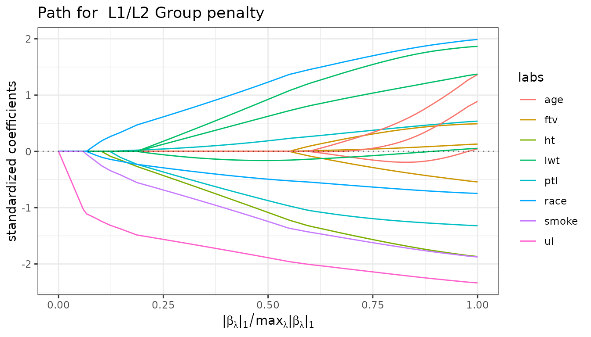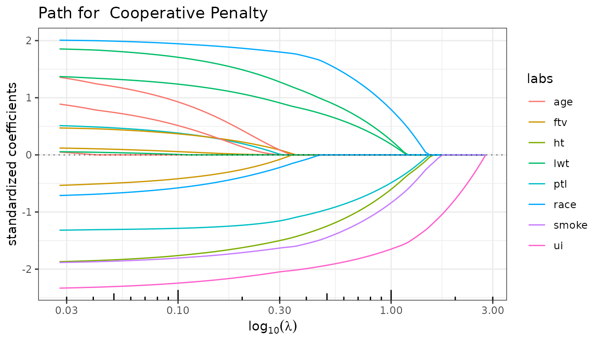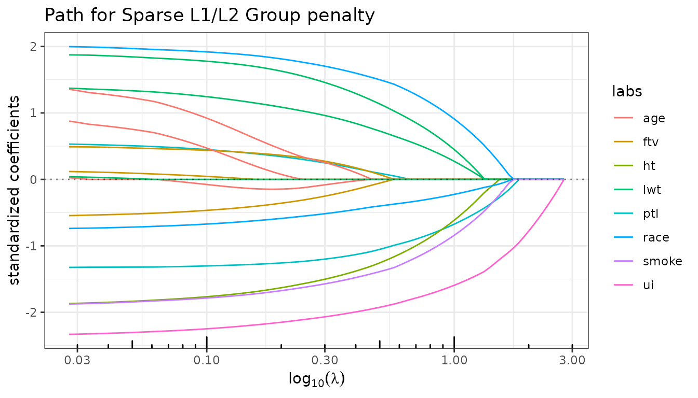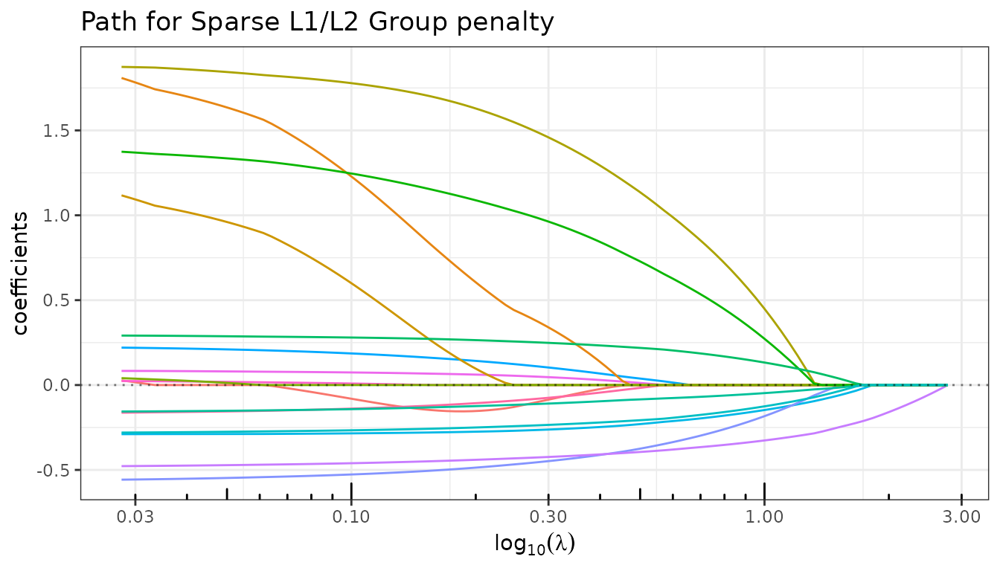

## Information criteria

`$criteria()` computes AIC, BIC, mBIC, eBIC and GCV from the estimated
degrees of freedom, storing the result as an \[`InformationCriteria`\]
R6 object in the field `$information_criteria` of the current fit. This
method is called automatically during fitting at no extra cost, so users
rarely need to invoke it directly — the main exception being when a
custom penalty term is desired.

``` r

fit_gl$criteria()
```

``` r

fit_gl$plot(type = "criteria")
```

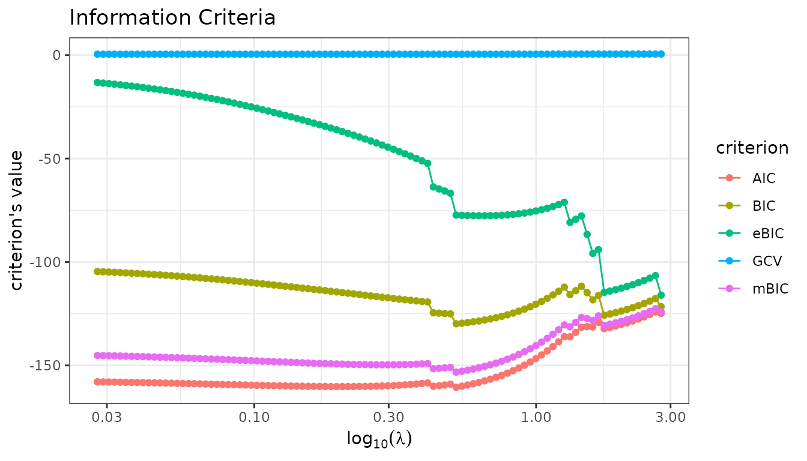

For greater flexibility, use the `plot` method of the
`InformationCriteria` object directly:

``` r

fit_gl$information_criteria$plot(c("AIC", "BIC", "mBIC"))
fit_sgl$information_criteria$plot("GCV")
```

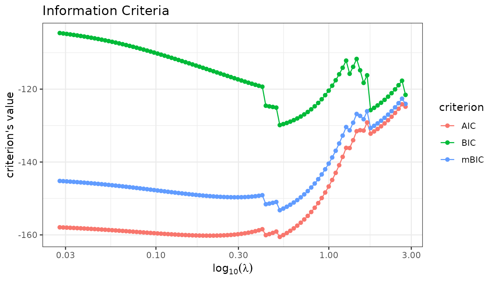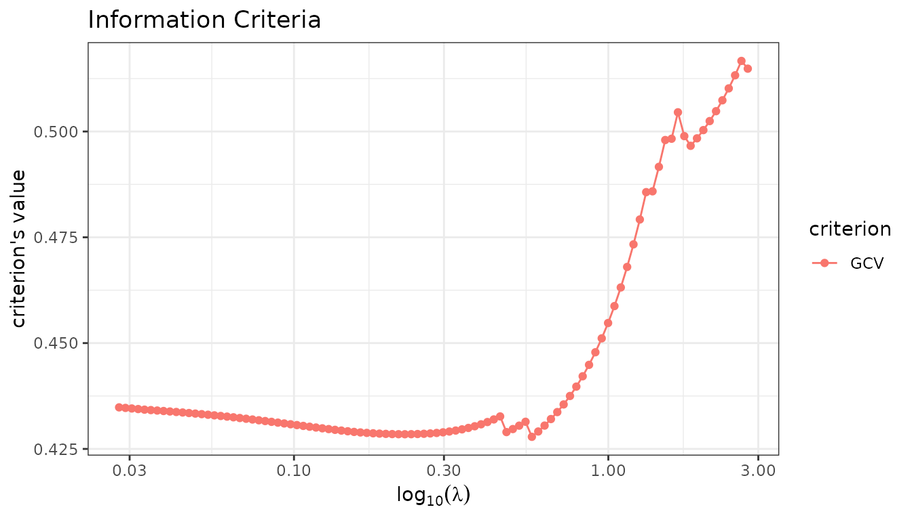

## Model extraction

`$get_model()` returns the coefficient vector selected by a given
criterion. With group penalties it is particularly informative to
examine which groups are entirely selected, which are partially active
(Sparse Group Lasso only), and which are excluded.

``` r

coef_gl  <- fit_gl$get_model("BIC")
coef_sgl <- fit_sgl$get_model("BIC")

active_gl  <- unique(group[coef_gl[-1]  != 0])
active_sgl <- unique(group[coef_sgl[-1] != 0])
cat("Group Lasso   — active groups (BIC):", group_names[active_gl],  "\n")
#> Group Lasso   — active groups (BIC): lwt race smoke ptl ht ui
cat("Sparse GL     — active groups (BIC):", group_names[active_sgl], "\n")
#> Sparse GL     — active groups (BIC): lwt race smoke ptl ht ui
```

The Sparse Group Lasso can additionally zero out individual predictors
within an active group:

``` r

active_vars_sgl <- which(coef_sgl[-1] != 0)
cat("Sparse GL — active predictors (BIC):", colnames(X)[active_vars_sgl], "\n")
#> Sparse GL — active predictors (BIC): lwt1 lwt3 white black smoke ptl1 ptl2m ht ui
```

An existing lambda value can also be used directly:

``` r

lambda_gl <- fit_gl$major_tuning
coef_gl_lambda <- fit_gl$get_model(lambda_gl[20])
cat("Non-zero Group Lasso coefficients for lambda =", round(lambda_gl[20], 3), "\n")
#> Non-zero Group Lasso coefficients for lambda = 1.148
print(coef_gl_lambda[coef_gl_lambda != 0])
#>   Intercept        lwt1        lwt2        lwt3       white       black 
#>  3.00152526  0.15075650 -0.05059705  0.10668998  0.08606329 -0.05956671 
#>       smoke        ptl1       ptl2m          ht          ui 
#> -0.09912127 -0.07510812  0.01632751 -0.11998203 -0.31761663
```

## Cross-validation

`$cross_validate()` performs K-fold cross-validation over the penalty
grid, storing the result as a \[`CrossValidation`\] R6 object in the
field `$cross_validation` of the current fit.

``` r

set.seed(42)
fit_gl$cross_validate(K = 10, verbose = FALSE)
fit_sgl$cross_validate(K = 10, verbose = FALSE)
```

``` r

fit_gl$plot(type = "crossval")
fit_sgl$plot(type = "crossval")
```

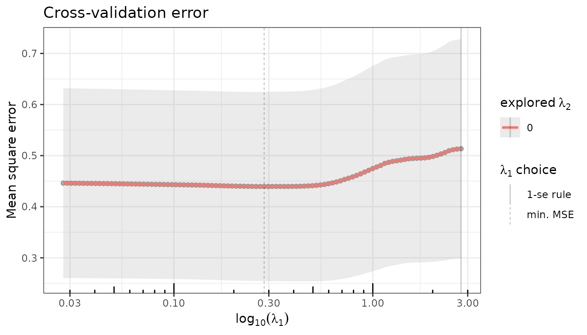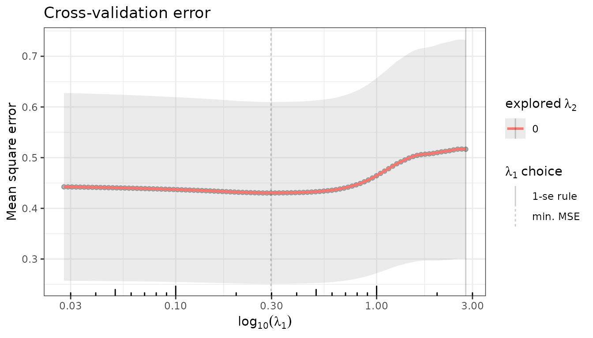

Model selection using the CV-minimizing penalty:

``` r

coef_gl_cv <- fit_gl$get_model("CV_min")
cat("Group Lasso — active groups (CV_min):",
    group_names[unique(group[coef_gl_cv[-1] != 0])], "\n")
#> Group Lasso — active groups (CV_min): age lwt race smoke ptl ht ui ftv
```

## Cross-validation on \\\lambda_1 \times \lambda_2\\

For regularizers with two penalties, cross-validation can be run on a
two-dimensional grid. Here we explore a range of `lambda2` values
jointly with the Group Lasso path:

``` r

set.seed(42)
fit_gl$cross_validate(K = 5, lambda2 = 10^seq(1, -3, len = 20), verbose = FALSE)
```

``` r

fit_gl$plot(type = "crossval")
fit_gl$cross_validation$plotCV_1D(se = FALSE) + ggplot2::ylim(c(0.04, 0.08))
#> Warning: Removed 2000 rows containing missing values or values outside the scale range
#> (`geom_point()`).
#> Warning: Removed 2000 rows containing missing values or values outside the scale range
#> (`geom_smooth()`).
```

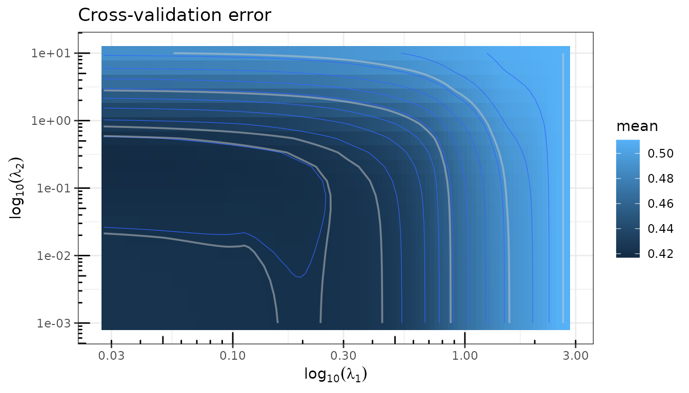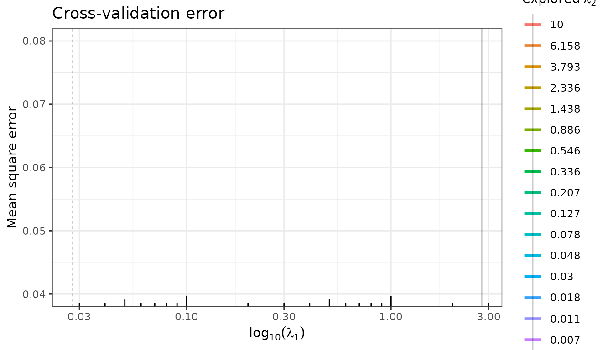

## Prediction

`$predict()` returns fitted values for the whole path, or for a specific
model selected by a criterion or a lambda value.

``` r

y_hat_gl  <- fit_gl$predict(selection = "CV_min")
y_hat_cl  <- fit_cl$predict(selection = "BIC")
y_hat_sgl <- fit_sgl$predict(selection = "CV_min")

r2_gl  <- fit_gl$r_squared[fit_gl$get_model("CV_min", type = "index")]
r2_cl  <- fit_cl$r_squared[fit_cl$get_model("BIC",    type = "index")]
r2_sgl <- fit_sgl$r_squared[fit_sgl$get_model("CV_min", type = "index")]
cat(sprintf(
  "R² Group Lasso (CV_min): %.3f\nR² Coop Lasso  (BIC)   : %.3f\nR² Sparse GL   (CV_min): %.3f\n",
  r2_gl, r2_cl, r2_sgl
))
#> R² Group Lasso (CV_min): 0.289
#> R² Coop Lasso  (BIC)   : 0.254
#> R² Sparse GL   (CV_min): 0.272
```

## Stability selection

`$stability()` estimates selection probabilities via repeated
sub-sampling (Meinshausen & Bühlmann, 2010). Variables that appear
consistently across sub-samples receive high probabilities and are
considered robustly selected. The stability path is stored as a
\[`StabilityPath`\] R6 object in the field `$stability_path` of the
current fit.

``` r

set.seed(42)
fit_gl$stability(n_subsamples = 200, verbose = FALSE)
```

``` r

fit_gl$plot(type = "stability", labels = var_labels)
```

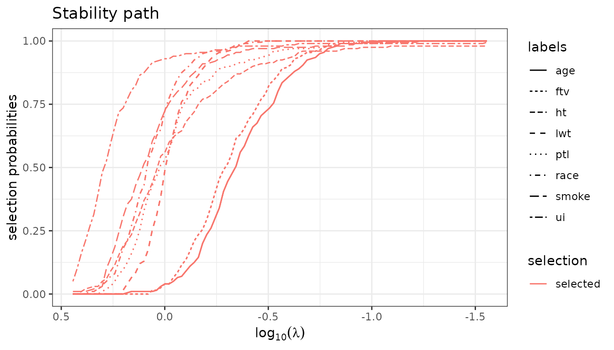

``` r

fit_gl$stability_path$plot(nvarsel = 5, labels = var_labels)
```

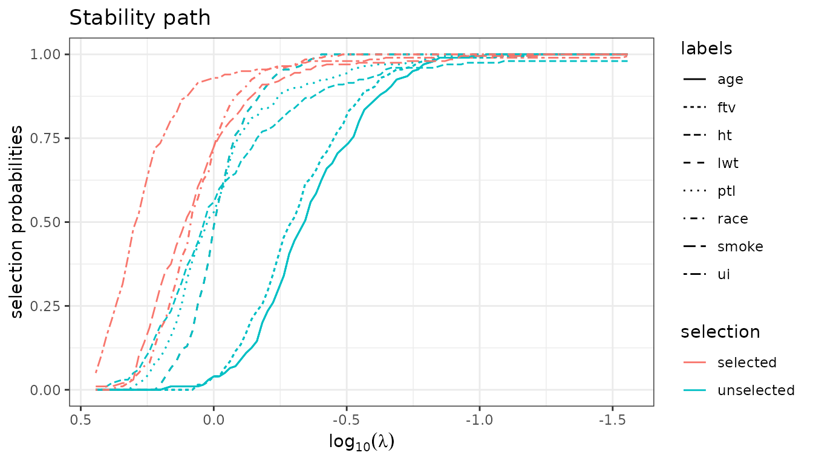

``` r

colnames(X)[fit_gl$stability_path$selection(nvarsel = 5)]
#> [1] "ui"    "white" "black" "smoke" "lwt1"
```

## Debiased Estimator

Group penalties induce shrinkage bias on the magnitude of estimated
coefficients. A standard remedy is to refit the model on the selected
support without penalization. This is implemented in **quadrupen** at no
extra computational cost — the refitted coefficients are computed
alongside the regularization path — and can be activated by setting the
`$debias` field to `TRUE`.

``` r

fit_gl$debias <- TRUE
fit_gl$plot_path(labels = var_labels)
```

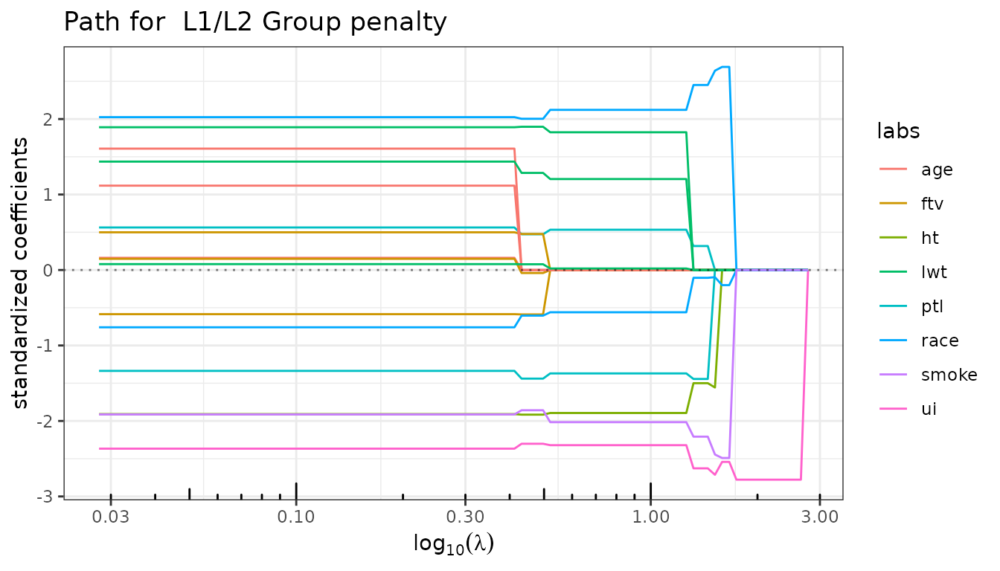

Since both versions are stored in the same object, it is straightforward
to compare the regularized and debiased solutions — for the path as well
as for CV error — by toggling `$debias`.

``` r

fit_gl$cross_validate(verbose = FALSE)
fit_gl$plot(type = "crossval")
```

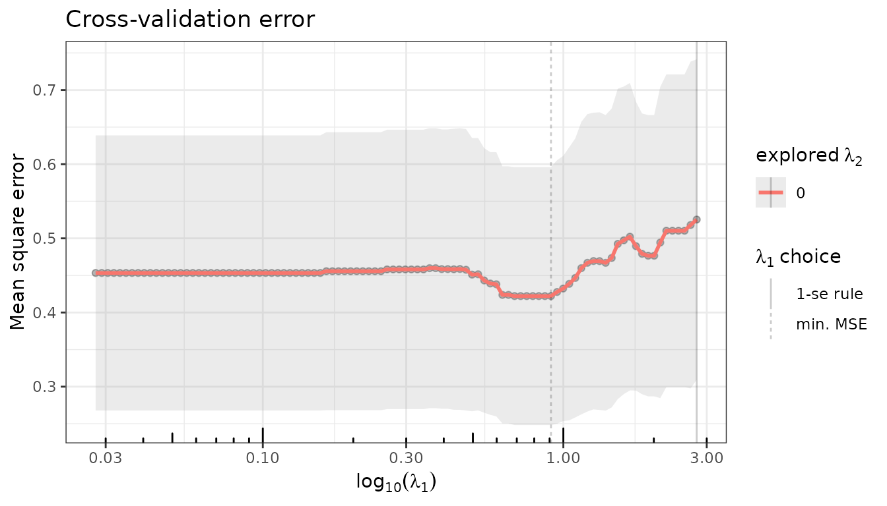

``` r

fit_gl$debias <- FALSE
fit_gl$plot_path(labels = var_labels)
```


Setting `$debias` back to `FALSE` restores the original regularized
coefficients.

``` r

fit_gl$debias <- FALSE
fit_gl$plot_path(labels = var_labels)
```

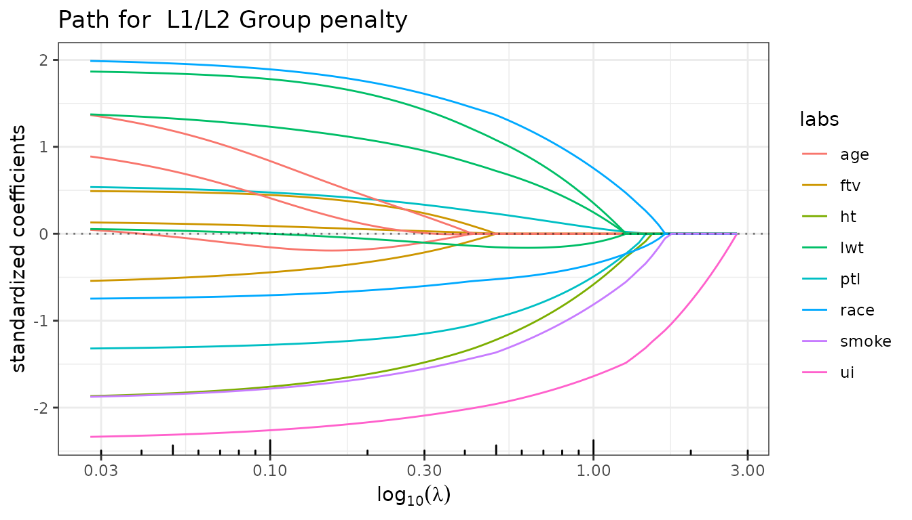
