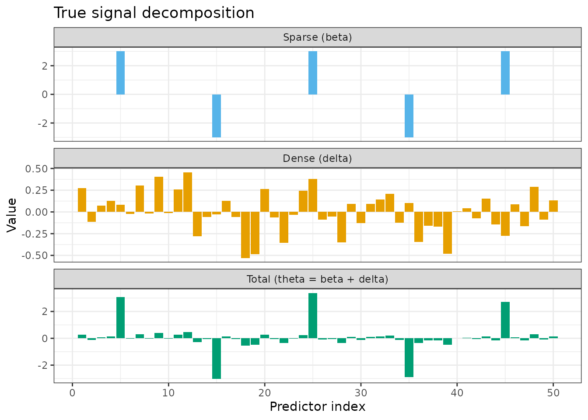
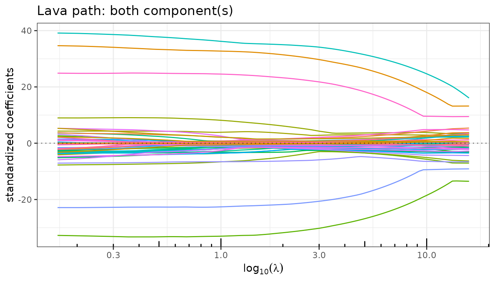
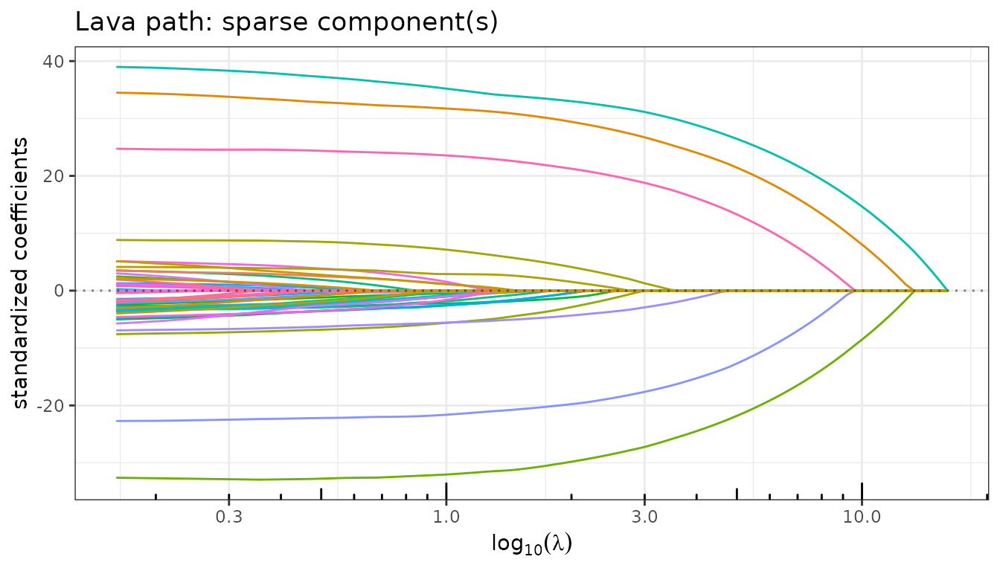
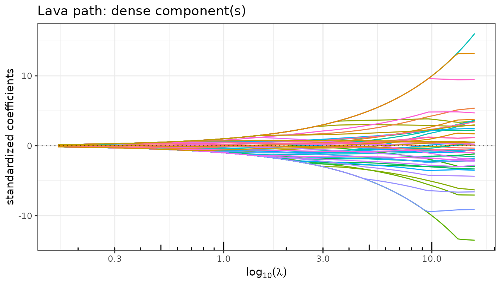
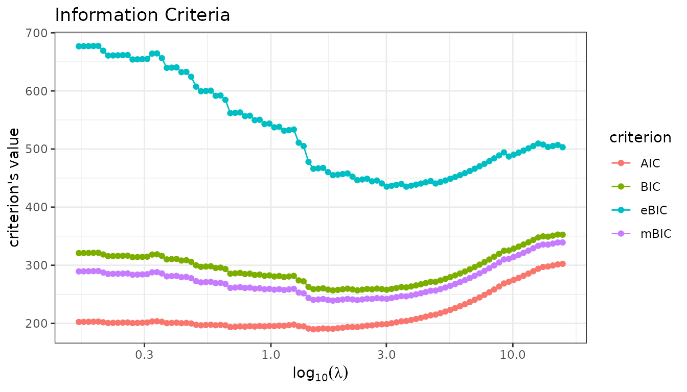
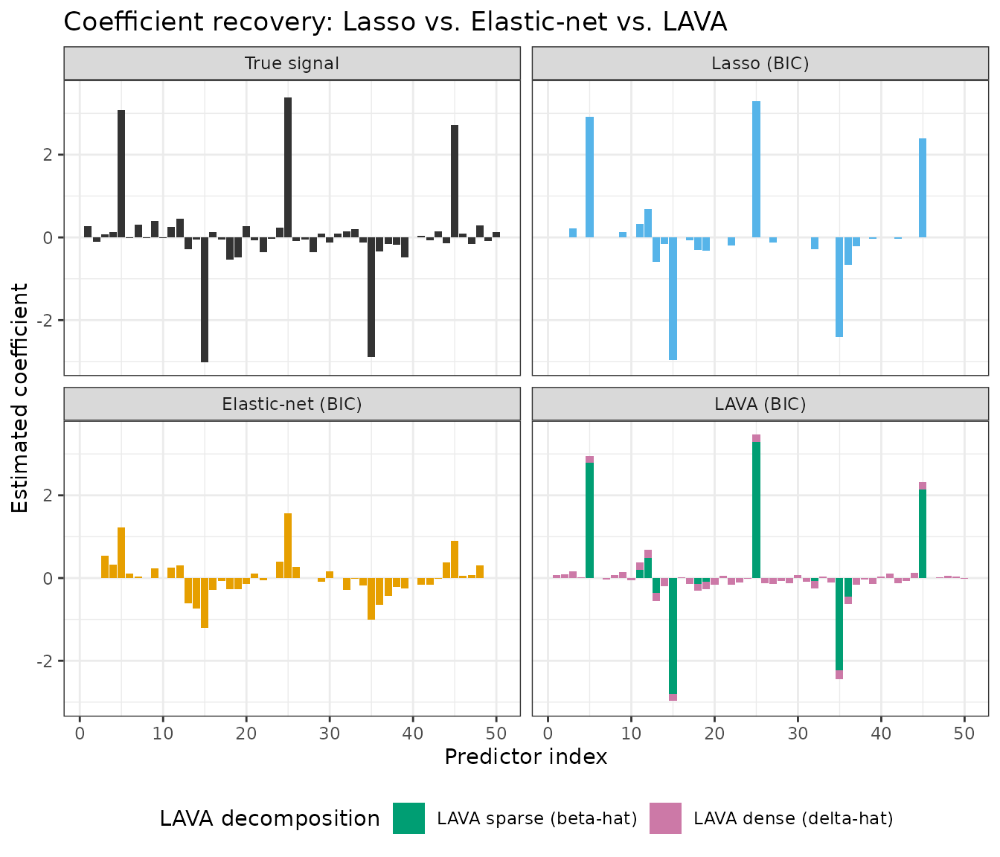
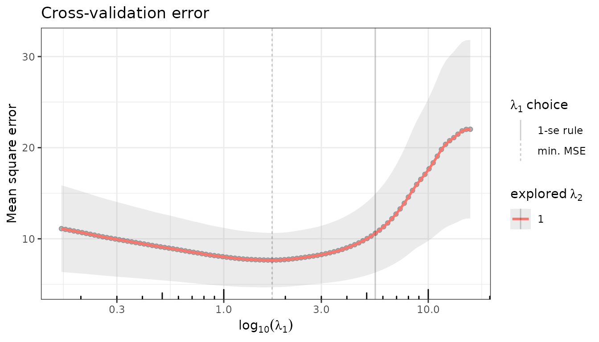
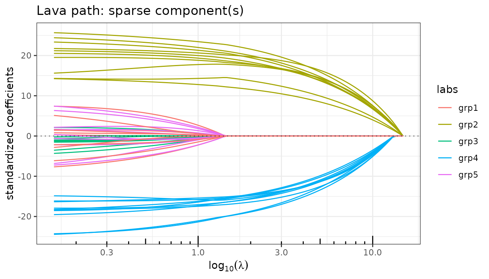
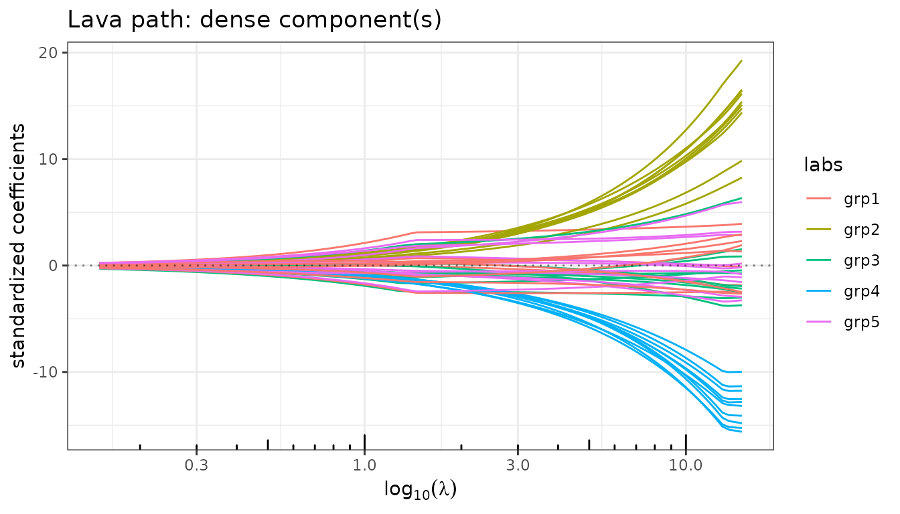

# LAVA: Recovering Sums of Sparse and Dense Signals

## Motivation

Classical sparse estimators such as the Lasso assume that the true
coefficient vector \\\theta\\ is itself sparse: only a few entries are
nonzero. This assumption fails when the signal has a **mixed structure**
— a small number of large, identifiable effects superimposed on a broad
background of many small effects. In this case neither the Lasso (too
sparse) nor ridge regression (too dense) is well-suited.

The **LAVA** estimator (Chernozhukov, Hansen & Liao, *Annals of
Statistics*, 2017) explicitly decomposes the coefficient vector as

\\\theta = \beta + \delta,\\

where \\\beta\\ is the **sparse** component (penalized by \\\lambda_1
\\\beta\\\_1\\) and \\\delta\\ is the **dense** component (penalized by
\\\frac{\lambda_2}{2} \delta^\top S\\ \delta\\). The joint criterion is

\\\min\_{\theta = \beta + \delta} \frac{1}{2n} \\y - X(\beta +
\delta)\\^2 + \lambda_1 \\\beta\\\_1 + \frac{\lambda_2}{2}\\ \delta^\top
S\\ \delta,\\

where \\S\\ is a positive semidefinite structuring matrix (identity by
default). By varying \\\lambda_1\\ along a regularization path (with
\\\lambda_2\\ fixed), **quadrupen** fits this model via
[`lava()`](https://jchiquet.github.io/quadrupen/reference/lava.md) and
returns an object of class `LavaFit` that gives access to both
components separately.

## Setup

``` r

library(quadrupen)
library(ggplot2)
```

### Simulation: a mixed sparse + dense signal

We simulate a linear model where the true signal is the sum of a sparse
part \\\beta\\ (five isolated large effects) and a dense part \\\delta\\
(small Gaussian perturbations on every predictor). Neither component
alone characterizes the signal.

``` r

set.seed(42)
n <- 100
p <- 50

## Sparse component: 5 large effects, the rest zero
beta  <- numeric(p)
beta[c(5, 15, 25, 35, 45)] <- c(3, -3, 3, -3, 3)

## Dense component: small effects on all predictors
delta <- rnorm(p, mean = 0, sd = 0.2)

## Total signal
theta <- beta + delta

## Predictors with moderate AR(1) correlation
rho   <- 0.5
Sigma <- toeplitz(rho^(0:(p - 1)))
X     <- matrix(rnorm(n * p), n, p) %*% chol(Sigma)
y     <- X %*% theta + rnorm(n, sd = 2)
```

``` r

df_truth <- data.frame(
  index     = rep(1:p, 3),
  value     = c(beta, delta, theta),
  component = factor(
    rep(c("Sparse (β)", "Dense (δ)", "Total (θ = β + δ)"), each = p),
    levels = c("Sparse (β)", "Dense (δ)", "Total (θ = β + δ)")
  )
)

ggplot(df_truth, aes(x = index, y = value, fill = component)) +
  geom_col() +
  facet_wrap(~ component, ncol = 1, scales = "free_y") +
  scale_fill_manual(values = c("#56B4E9", "#E69F00", "#009E73"), guide = "none") +
  labs(x = "Predictor index", y = "Value",
       title = "True signal decomposition") +
  theme_bw()
```



## Fitting with `lava()`

[`lava()`](https://jchiquet.github.io/quadrupen/reference/lava.md) takes
the same interface as
[`sparse_lm()`](https://jchiquet.github.io/quadrupen/reference/sparse_lm.md).
The `lambda2` argument controls the ridge-like penalty on the dense
component.

``` r

fit_lava <- lava(X, y, lambda2 = 1)
fit_lava
#> Linear regression with Lava penalizer.
#> - number of coefficients: 50 + intercept
#> - lambda regularization: 100 points from 16.1 to 0.161
#> - gamma regularization: 1
```

The returned object is an R6 instance of class `LavaFit`, inheriting
from `QuadrupenFit`. In addition to all the standard fields and methods
(`$coefficients`, `$criteria()`, `$cross_validate()`, etc.), it exposes
two component-specific fields:

- `$sparse_coef`: the sparse part \\\hat\beta\\ — a \\p \times
  \|\lambda_1\|\\ matrix along the path.
- `$dense_coef`: the dense part \\\hat\delta = \hat\theta - \hat\beta\\
  — same dimensions.

## Regularization paths by component

`$plot_path()` accepts a `component` argument (`"both"`, `"sparse"`,
`"dense"`) to display each part of the decomposition independently.

``` r

fit_lava$plot_path(component = "both",   labels = NULL)
fit_lava$plot_path(component = "sparse", labels = NULL)
fit_lava$plot_path(component = "dense",  labels = NULL)
```



As \\\lambda_1\\ increases (right to left on the path):

- The **sparse** path shows the usual Lasso-like variable selection:
  large effects enter early and small ones remain zero.
- The **dense** path is smooth and non-zero everywhere: the ridge
  penalty ensures that \\\hat\delta\\ is distributed across all
  predictors.
- The **total** path combines both: it never reaches exactly zero
  because the dense component picks up residual signal.

## Model Selection

Let us plot the information criteria along the path. The BIC and eBIC
select a model with a couple of large effects in the sparse part, while
AIC selects a more complex model with more non-zero entries in the
sparse component. mBIC is more conservative, as expected.

``` r

fit_lava$information_criteria$plot(c("AIC", "BIC", "eBIC", "mBIC"))
```



## Model extraction and decomposition

`$get_model()` extracts the total estimated coefficient \\\hat\theta\\
at a selected \\\lambda_1\\. The corresponding sparse and dense
components can be recovered from `$sparse_coef` and `$dense_coef` at the
same index.

``` r

idx <- fit_lava$get_model("BIC", type = "index")

theta_hat <- fit_lava$get_model("BIC")[-1]          # drop intercept
beta_hat  <- as.numeric(fit_lava$sparse_coef[, idx])
delta_hat <- as.numeric(fit_lava$dense_coef[, idx])

cat("Non-zero entries in sparse component (BIC):",
    sum(beta_hat != 0), "\n")
#> Non-zero entries in sparse component (BIC): 12
cat("Non-zero entries in dense component (BIC): ",
    sum(delta_hat != 0), "\n")
#> Non-zero entries in dense component (BIC):  50
cat("Positions with |beta_hat| > 1:",
    which(abs(beta_hat) > 1), "\n")
#> Positions with |beta_hat| > 1: 5 15 25 35 45
```

The sparse component correctly locates the five large effects — those
with `|beta_hat| > 1` match the true positions exactly. The dense
component is non-zero everywhere, absorbing the background of small
signals.

## Comparing estimators

We compare LAVA against the Lasso and Elastic-net at their BIC-selected
models. In the LAVA panel, bars are split into two layers drawn with
`geom_col`: the **total** estimate \\\hat\theta = \hat\beta +
\hat\delta\\ is drawn first (pink, dense component), and the **sparse**
component \\\hat\beta\\ is overlaid on top (green). The remaining pink
portion at the tips of active bars represents the dense contribution
\\\hat\delta\\; the small pink bars at inactive positions are the dense
signal alone.

``` r

fit_lasso <- lasso(X, y)
fit_enet  <- elastic_net(X, y, lambda2 = 1)
```

``` r

get_coef <- function(fit) {
  b <- fit$get_model("BIC")
  if ("Intercept" %in% names(b)) b <- b[-1]
  as.numeric(b)
}

method_levels <- c("True signal", "Lasso (BIC)", "Elastic-net (BIC)", "LAVA (BIC)")

## Non-LAVA panels: one bar per predictor
df_base <- rbind(
  data.frame(method = "True signal",       index = 1:p,
             value = theta,                fill_grp = "True signal"),
  data.frame(method = "Lasso (BIC)",       index = 1:p,
             value = get_coef(fit_lasso),  fill_grp = "Lasso"),
  data.frame(method = "Elastic-net (BIC)", index = 1:p,
             value = get_coef(fit_enet),   fill_grp = "Elastic-net")
)
df_base$method <- factor(df_base$method, levels = method_levels)

## LAVA panel: dense total drawn first, sparse component overlaid on top
df_lava_dense <- data.frame(
  method   = factor("LAVA (BIC)", levels = method_levels),
  index    = 1:p,
  value    = as.numeric(theta_hat),
  fill_grp = "LAVA dense (δ̂)"
)
df_lava_sparse <- data.frame(
  method   = factor("LAVA (BIC)", levels = method_levels),
  index    = 1:p,
  value    = beta_hat,
  fill_grp = "LAVA sparse (β̂)"
)

fill_palette <- c(
  "True signal"       = "grey20",
  "Lasso"             = "#56B4E9",
  "Elastic-net"       = "#E69F00",
  "LAVA dense (δ̂)"   = "#CC79A7",
  "LAVA sparse (β̂)"  = "#009E73"
)

ggplot(mapping = aes(x = index, y = value, fill = fill_grp)) +
  geom_col(data = df_base) +
  geom_col(data = df_lava_dense) +
  geom_col(data = df_lava_sparse) +
  facet_wrap(~ method, ncol = 2) +
  scale_fill_manual(
    values = fill_palette,
    breaks = c("LAVA sparse (β̂)", "LAVA dense (δ̂)"),
    name   = "LAVA decomposition"
  ) +
  labs(x = "Predictor index", y = "Estimated coefficient",
       title = "Coefficient recovery: Lasso vs. Elastic-net vs. LAVA") +
  theme_bw() +
  theme(legend.position = "bottom")
#> Warning in min(x): no non-missing arguments to min; returning Inf
#> Warning in max(x): no non-missing arguments to max; returning -Inf
#> Warning in min(x): no non-missing arguments to min; returning Inf
#> Warning in max(x): no non-missing arguments to max; returning -Inf
#> Warning in min(x): no non-missing arguments to min; returning Inf
#> Warning in max(x): no non-missing arguments to max; returning -Inf
#> Warning in min(x): no non-missing arguments to min; returning Inf
#> Warning in max(x): no non-missing arguments to max; returning -Inf
#> Warning in min(x): no non-missing arguments to min; returning Inf
#> Warning in max(x): no non-missing arguments to max; returning -Inf
#> Warning in min(x): no non-missing arguments to min; returning Inf
#> Warning in max(x): no non-missing arguments to max; returning -Inf
#> Warning in min(x): no non-missing arguments to min; returning Inf
#> Warning in max(x): no non-missing arguments to max; returning -Inf
```



- The **Lasso** selects a handful of predictors but cannot represent the
  dense background.
- The **Elastic-net** spreads a small weight across more predictors, but
  conflates the two structural components.
- **LAVA** explicitly decomposes the signal: the green bars identify the
  large sparse effects precisely; the pink portions (small rims at
  active positions, full bars at inactive positions) capture the diffuse
  dense background.

## Cross-validation

`$cross_validate()` works identically to the other `QuadrupenFit`
subclasses.

``` r

set.seed(42)
fit_lava$cross_validate(K = 10, verbose = FALSE)
fit_lava$plot(type = "crossval")
```



``` r

set.seed(42)
fit_lasso$cross_validate(K = 10, verbose = FALSE)
fit_enet$cross_validate(K = 10, verbose = FALSE)

idx_cv   <- fit_lava$get_model("CV_min", type = "index")
beta_cv  <- as.numeric(fit_lava$sparse_coef[, idx_cv])
cat("Non-zero entries in sparse component (CV_min):",
    sum(beta_cv != 0), "\n")
#> Non-zero entries in sparse component (CV_min): 13
cat("Positions with |beta_cv| > 1:",
    which(abs(beta_cv) > 1), "\n")
#> Positions with |beta_cv| > 1: 5 15 25 35 45
```

------------------------------------------------------------------------

## Group LAVA: group-sparse + dense decomposition

[`group_lava()`](https://jchiquet.github.io/quadrupen/reference/group_lava.md)
extends LAVA by replacing the element-wise \\\ell_1\\ penalty on
\\\beta\\ with a group-wise mixed norm \\\Omega_g(\beta)\\:

\\\min\_{\theta = \beta + \delta} \frac{1}{2n} \\y - X(\beta +
\delta)\\^2 + \lambda_1\\ \Omega_g(\beta) + \frac{\lambda_2}{2}\\
\delta^\top S\\ \delta.\\

This is appropriate when the sparse component has **group structure**:
entire groups of predictors are either active or silent. The `type`
argument selects the group norm (\\\ell_1/\ell_2\\ by default, or
\\\ell_1/\ell\_\infty\\).

### Simulation with a group-sparse signal

``` r

## 5 groups of 10 predictors; groups 2 and 4 are active in the sparse part
group  <- rep(1:5, each = 10)
beta_g <- rep(c(0, 2, 0, -2, 0), each = 10)
delta_g <- rnorm(p, mean = 0, sd = 0.2)
theta_g <- beta_g + delta_g

y2 <- X %*% theta_g + rnorm(n, sd = 2)

group_names <- paste0("grp", 1:5)
var_labels  <- group_names[group]
```

### Fitting

``` r

fit_gl <- group_lava(X, y2, group = group, lambda2 = 1)
fit_gl
#> Linear regression with group Lava l1/l2 penalizer.
#> - number of coefficients: 50 + intercept
#> - lambda regularization: 100 points from 14.9 to 0.149
#> - gamma regularization: 1
```

### Paths of the sparse and dense components

``` r

fit_gl$plot_path(component = "sparse", labels = var_labels)
fit_gl$plot_path(component = "dense",  labels = var_labels)
```



The sparse path shows entire groups entering the model simultaneously
(Group Lasso behaviour), while the dense path remains diffuse and
non-zero everywhere.

### Model selection

For group selection problems, eBIC (which carries a stronger penalty of
\\\log(n) + 2\log(p)\\) is generally more conservative than BIC and
better adapted to identifying which groups are truly active.

### Group identification

``` r

idx_ebic   <- fit_gl$get_model("eBIC", type = "index")
beta_g_hat <- as.numeric(fit_gl$sparse_coef[, idx_ebic])

active_groups <- unique(group[beta_g_hat != 0])
cat("Active groups in sparse component (eBIC):", group_names[active_groups], "\n")
#> Active groups in sparse component (eBIC): grp2 grp4
```

------------------------------------------------------------------------

## Reference

Chernozhukov, V., Hansen, C., & Liao, Y. (2017). A lava attack on the
recovery of sums of dense and sparse signals. *The Annals of
Statistics*, 45(1), 39–76. <https://doi.org/10.1214/16-AOS1434>
