# Sparse Linear Regression with Quadrupen

## Setup

``` r

library(quadrupen)
#> 'quadrupen' package version 1.0-0
data("Birthwt", package = "grpreg")
y <- Birthwt$bwt[-130] ## outlier
X <- Birthwt$X[-130, ]
```

The `Birthwt` dataset contains birth weight data with 189 observations
and 16 predictors. We use it throughout this vignette to illustrate
sparse linear regression.

## Fitting sparse linear models

The main entry point is
[`sparse_lm()`](https://jchiquet.github.io/quadrupen/reference/sparse_lm.md),
which fits a regularization path for several sparse penalties: `"l1"`
(Lasso/Elastic-net), `"mcp"` (Minimax Concave Penalty) and `"scad"`
(Smoothly Clipped Absolute Deviation). Convenience wrappers
[`lasso()`](https://jchiquet.github.io/quadrupen/reference/sparse_lm.md),
[`mcp()`](https://jchiquet.github.io/quadrupen/reference/sparse_lm.md),
[`scad()`](https://jchiquet.github.io/quadrupen/reference/sparse_lm.md)
and
[`elastic_net()`](https://jchiquet.github.io/quadrupen/reference/sparse_lm.md)
are also available.

### Lasso

``` r

fit_lasso <- lasso(X, y, minratio = 1e-2)
fit_lasso
#> Linear regression with L1  penalizer.
#> - number of coefficients: 16 + intercept
#> - lambda regularization: 100 points from 2.78 to 0.0278
#> - gamma regularization: 0
```

### SCAD

SCAD is a non-convex penalty that matches the Lasso near the origin and
tapers to a constant for large coefficients, thereby eliminating
shrinkage bias for strong signals. The shape parameter `eta` must be
greater than 2.

``` r

fit_scad <- scad(X, y, eta = 4, minratio = 1e-2)
fit_scad
#> Linear regression with SCAD  penalizer.
#> - number of coefficients: 16 + intercept
#> - lambda regularization: 100 points from 2.78 to 0.0278
#> - gamma regularization: 0
```

### MCP

MCP applies a linearly diminishing marginal penalty that vanishes once a
coefficient exceeds `eta × lambda1`, yielding near-unbiased estimates
for large signals. The shape parameter `eta` must be greater than 1.

``` r

fit_mcp <- mcp(X, y, eta = 3, minratio = 1e-2)
fit_mcp
#> Linear regression with MCP  penalizer.
#> - number of coefficients: 16 + intercept
#> - lambda regularization: 100 points from 2.78 to 0.0278
#> - gamma regularization: 0
```

### Elastic-Net

The Elastic-net combines an \\\ell_1\\ and an \\\ell_2\\ penalty,
trading off sparsity against grouping of correlated predictors. The
`lambda2` argument controls the ridge component.

``` r

fit_enet <- elastic_net(X, y, lambda2 = 1, minratio = 1e-2)
fit_enet
#> Linear regression with L1 plus L2-regularization penalizer.
#> - number of coefficients: 16 + intercept
#> - lambda regularization: 100 points from 2.78 to 0.0278
#> - gamma regularization: 1
```

### Fit objects

All objects returned by
[`sparse_lm()`](https://jchiquet.github.io/quadrupen/reference/sparse_lm.md)
and its wrappers are R6 instances of the class `SparseFit`, inheriting
from `QuadrupenFit`. These objects (see \[`QuadrupenFit`\]) store all
data related to the fit, accessible directly via named fields (e.g.,
`fit_lasso$coefficients`, `fit_lasso$deviance`,
`fit_lasso$degrees_freedom`; see `str(fit_lasso)` and the
documentation).

They also provide methods for visualizing and analyzing the fit, and for
pursuing complementary analyses such as model selection,
cross-validation, and stability selection. For users unfamiliar with R6
classes, S3 methods are exported for the most common operations (e.g.,
`plot(fit_lasso)` is equivalent to `fit_lasso$plot()`), but the R6
methods expose more options.

## Regularization paths

`$plot_path()` (or `plot(fit, type = "path")`) displays how coefficients
evolve along the penalty path.

``` r

fit_lasso$plot_path(xvar="fraction", log_scale = FALSE)
fit_mcp$plot_path(labels = colnames(X))
fit_scad$plot_path()
fit_enet$plot_path(standardize=FALSE)
```

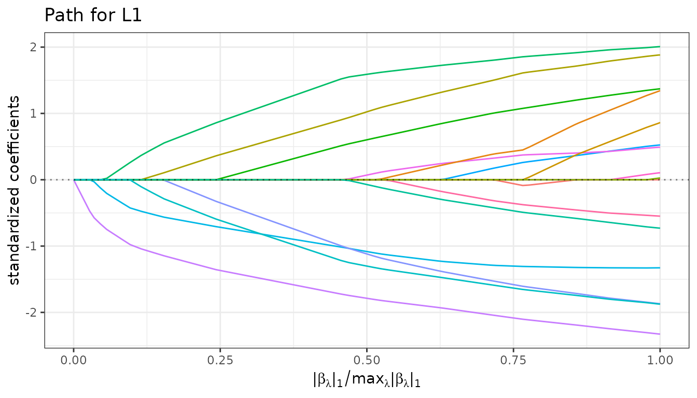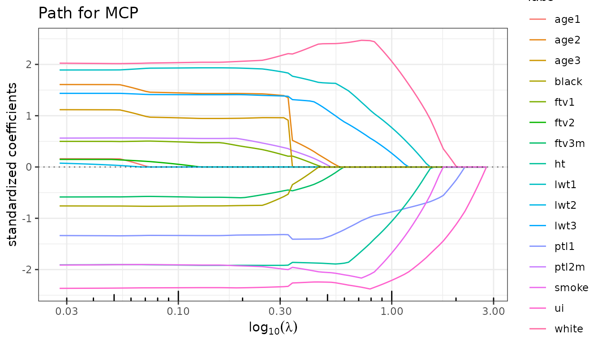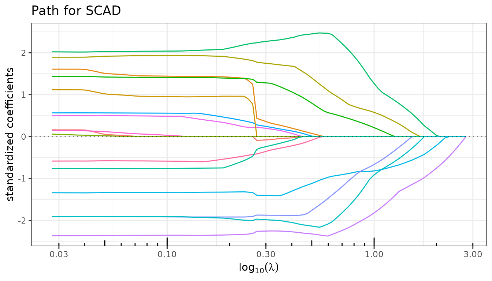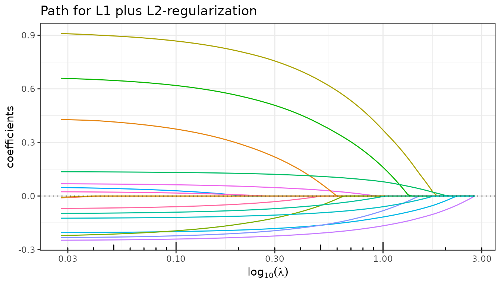

## Information criteria

`$criteria()` computes AIC, BIC, mBIC, eBIC and GCV from the estimated
degrees of freedom, storing the result as an \[`InformationCriteria`\]
R6 object in the field `$information_criteria` of the current fit. This
method is called automatically during fitting
([`sparse_lm()`](https://jchiquet.github.io/quadrupen/reference/sparse_lm.md)
or any wrapper) at no additional computational cost, so users rarely
need to invoke it manually — the main exception being when a custom
penalty term is desired.

``` r

fit_lasso$criteria()
```

``` r

fit_lasso$plot(type = "criteria")
```

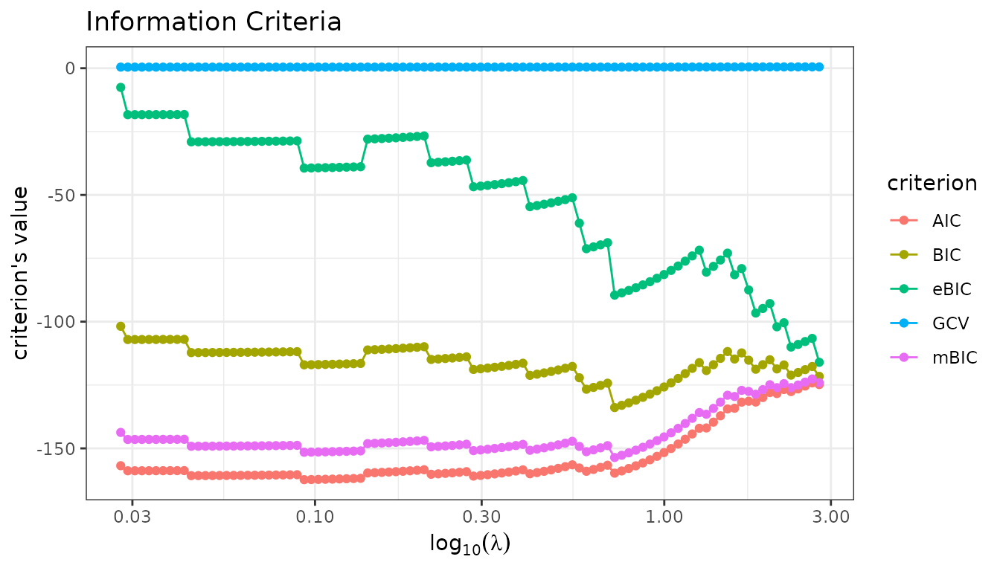

For greater flexibility, use the `plot` method of the
`InformationCriteria` object directly to select which criteria to
display:

``` r

fit_lasso$information_criteria$plot(c("AIC", "BIC", "mBIC"))
fit_mcp$information_criteria$plot("GCV")
```

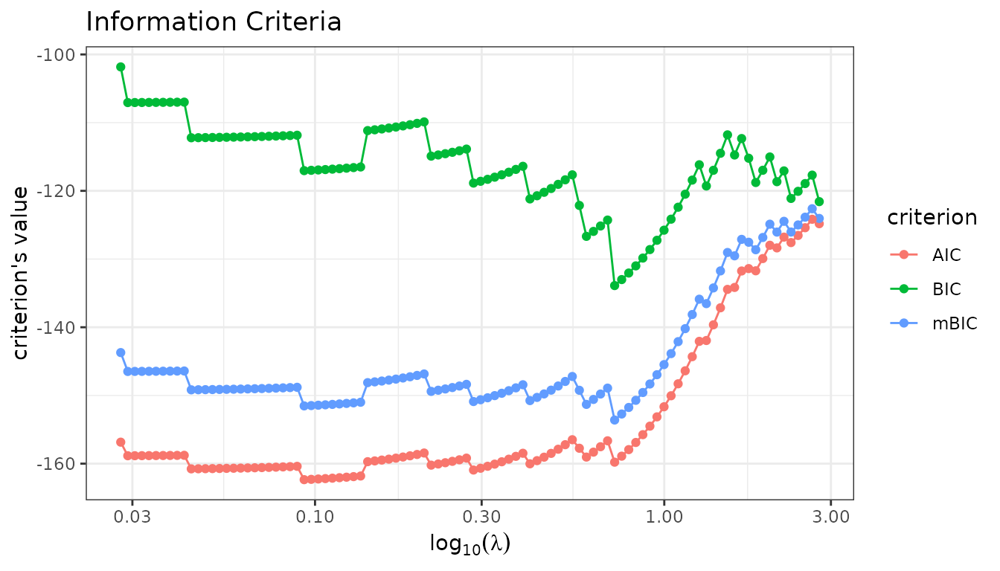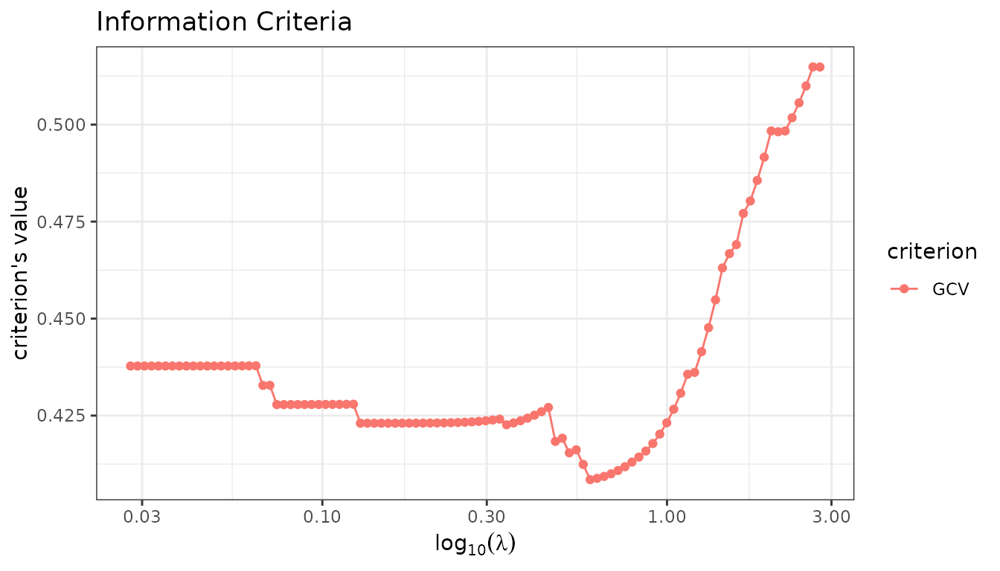

## Model extraction

`$get_model()` extracts the coefficient vector selected by a given
criterion.

``` r

coef_lasso_bic <- fit_lasso$get_model("BIC")
coef_mcp_bic   <- fit_mcp$get_model("BIC")

cat("Non-zero Lasso coefficients (BIC):\n")
#> Non-zero Lasso coefficients (BIC):
print(coef_lasso_bic[coef_lasso_bic != 0])
#>  Intercept       lwt1       lwt3      white      smoke       ptl1         ht 
#>  2.9931326  0.9025747  0.5131904  0.2216380 -0.1817029 -0.2217365 -0.2969746 
#>         ui 
#> -0.3530479

cat("\nNon-zero MCP coefficients (BIC):\n")
#> 
#> Non-zero MCP coefficients (BIC):
print(coef_mcp_bic[coef_mcp_bic != 0])
#>  Intercept       lwt1       lwt3      white      smoke       ptl1         ht 
#>  3.0186084  1.5356100  0.8812085  0.3530156 -0.3138259 -0.2674971 -0.5596069 
#>         ui 
#> -0.4685982
```

An existing lambda value can also be passed directly:

``` r

lambda_lasso <- fit_lasso$major_tuning
coef_lasso_lambda <- fit_lasso$get_model(lambda_lasso[18])

cat("Non-zero Lasso coefficients for lambda = ", round(lambda_lasso[18], 2), "\n")
#> Non-zero Lasso coefficients for lambda =  1.26
print(coef_lasso_lambda[coef_lasso_lambda != 0])
#>     Intercept          lwt1          lwt3         white         smoke 
#>  2.9725364689  0.3611176526  0.0005800756  0.1252915157 -0.0885736060 
#>          ptl1            ht            ui 
#> -0.1545302819 -0.0972542515 -0.2777916481
```

## Cross-validation

`$cross_validate()` performs K-fold cross-validation over the penalty
grid, storing the result as a \[`CrossValidation`\] R6 object in the
field `$cross_validation` of the current fit.

``` r

set.seed(42)
fit_lasso$cross_validate(K = 10, verbose = FALSE)
fit_mcp$cross_validate(K = 10, verbose = FALSE)
```

``` r

fit_lasso$plot(type = "crossval")
fit_mcp$plot(type = "crossval")
```

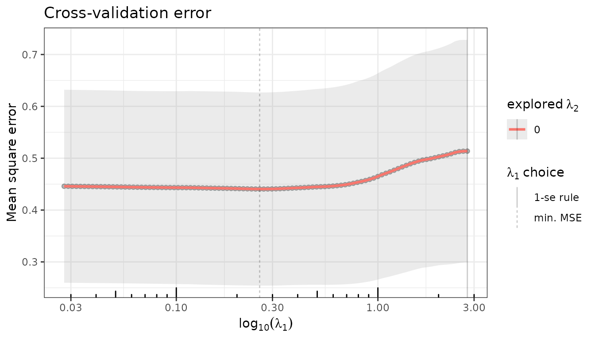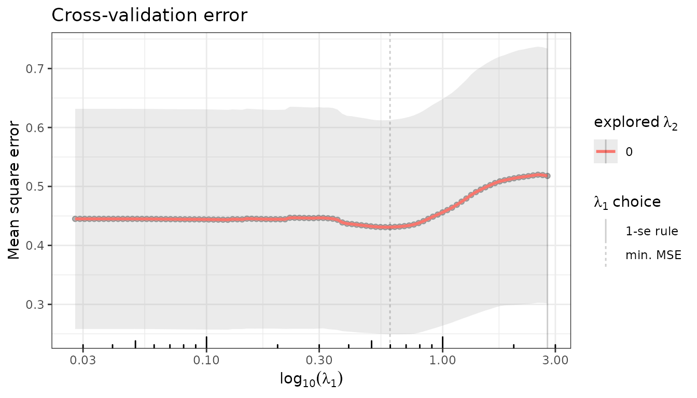

Model selection using the CV-minimizing penalty:

``` r

coef_lasso_cv <- fit_lasso$get_model("CV_min")
cat("Non-zero Lasso coefficients (CV min):\n")
#> Non-zero Lasso coefficients (CV min):
print(coef_lasso_cv[coef_lasso_cv != 0])
#>   Intercept        age1        age2        lwt1        lwt3       white 
#>  3.02725378 -0.02641033  0.54176929  1.53325763  1.02742153  0.26518579 
#>       black       smoke        ptl1       ptl2m          ht          ui 
#> -0.09330393 -0.24008374 -0.28310940  0.08271167 -0.46254426 -0.42205020 
#>        ftv1       ftv3m 
#>  0.05758491 -0.09951214
```

## Cross-validation on \\\lambda_1 \times \lambda_2\\

For regularizers with two penalties (typically the Elastic-net),
cross-validation can be run on a two-dimensional grid:

``` r

set.seed(42)
fit_enet$cross_validate(K = 5, lambda2 = 10^seq(1, -3, len=20), verbose = FALSE)
```

``` r

fit_enet$plot(type = "crossval")
fit_enet$cross_validation$plotCV_1D(se =  FALSE) + ggplot2::ylim(c(0.4, 0.55))
```

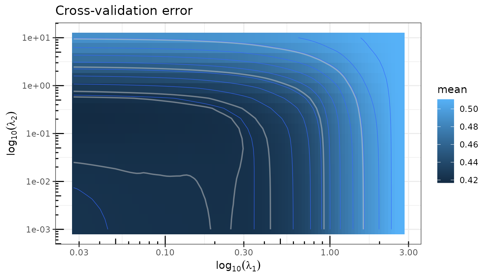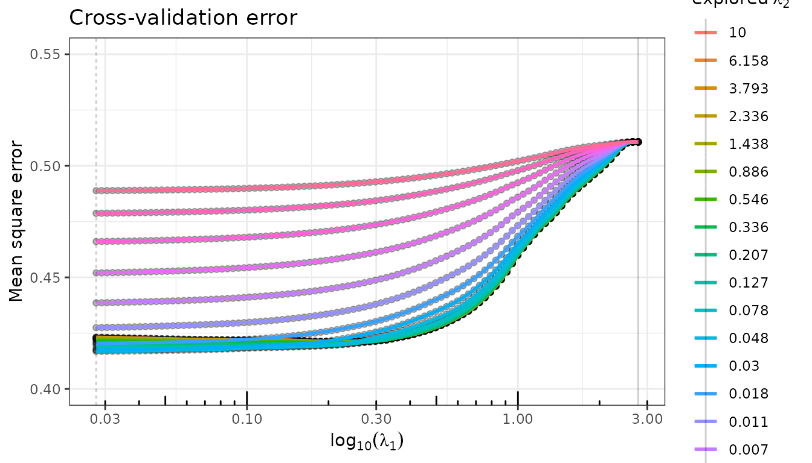

## Prediction

`$predict()` returns fitted values for the whole path, or for a specific
model selected by a criterion or a lambda value.

``` r

## Predictions at the CV_min-selected model
y_hat_lasso <- fit_lasso$predict(selection = "CV_min")
y_hat_mcp   <- fit_mcp$predict(selection = "CV_min")
y_hat_enet  <- fit_enet$predict(selection = "CV_min")

## R² at the selected model
r2_lasso <- fit_lasso$r_squared[fit_lasso$get_model("CV_min", type = "index")]
r2_mcp   <- fit_mcp$r_squared[fit_mcp$get_model("CV_min", type = "index")]
r2_enet  <- fit_enet$r_squared[fit_enet$get_model("CV_min", type = "index")]
cat(sprintf("R² Lasso (CV_min): %.3f\nR² MCP   (CV_min): %.3f\nR² Enet  (CV_min): %.3f\n", r2_lasso, r2_mcp, r2_enet))
#> R² Lasso (CV_min): 0.276
#> R² MCP   (CV_min): 0.265
#> R² Enet  (CV_min): 0.218
```

## Stability selection

`$stability()` estimates selection probabilities via repeated
sub-sampling (Meinshausen & Bühlmann, 2010). Variables that appear
consistently across sub-samples receive high probabilities and are
considered robustly selected. The stability path is stored as a
\[`StabilityPath`\] R6 object in the field `$stability_path` of the
current fit.

``` r

set.seed(42)
fit_lasso$stability(n_subsamples = 200, verbose = FALSE)
```

``` r

fit_lasso$plot(type = "stability")
#> Warning: This manual palette can handle a maximum of 13 values. You have
#> supplied 16
#> Warning: Removed 300 rows containing missing values or values outside the scale range
#> (`geom_line()`).
```

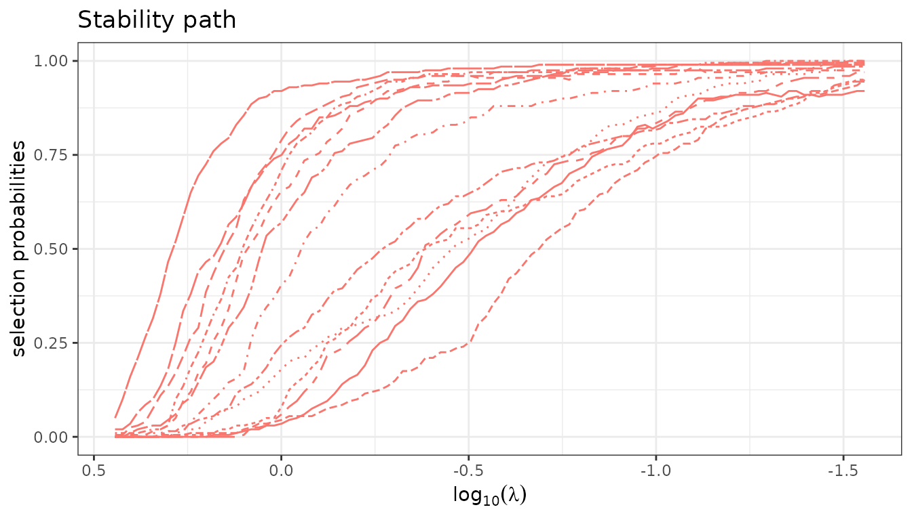

``` r

fit_lasso$stability_path$plot(nvarsel = 7)
```

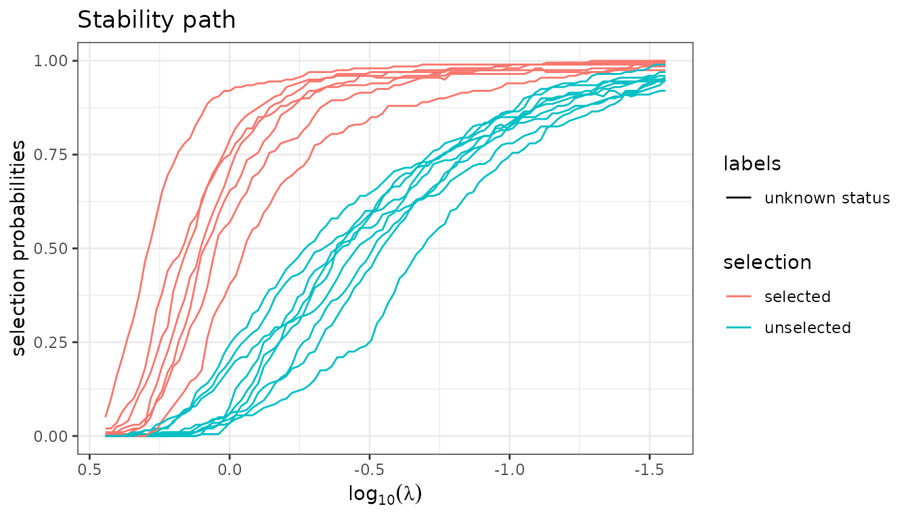

``` r

colnames(X)[fit_lasso$stability_path$selection(nvarsel = 7) ]
#> [1] "ui"    "white" "ptl1"  "smoke" "lwt1"  "ht"    "lwt3"
```

## Debiased Estimators

Every \\\ell_1\\-based regularizer is known to be biased due to the
shrinkage effect. A standard remedy is to refit the model on the
selected support without penalization. This is implemented in
**quadrupen** at no extra computational cost — the refitted coefficients
are computed alongside the regularization path — and can be activated by
setting the `$debias` field to `TRUE`.

``` r

fit_lasso$debias <- TRUE
fit_lasso$plot_path()
```

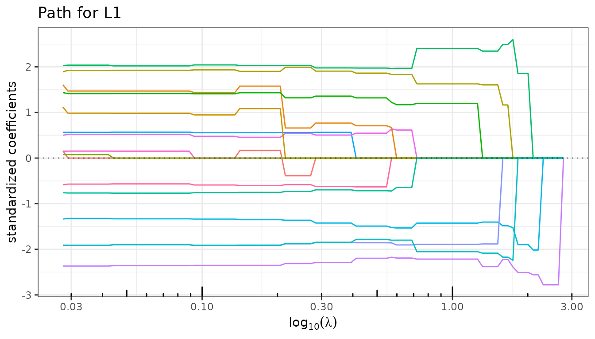

Since both versions are stored in the same object, it is straightforward
to compare the regularized and debiased solutions — for the path as well
as for CV error — by toggling `$debias`.

``` r

fit_lasso$cross_validate(verbose = FALSE)
fit_lasso$plot(type = "crossval")
```

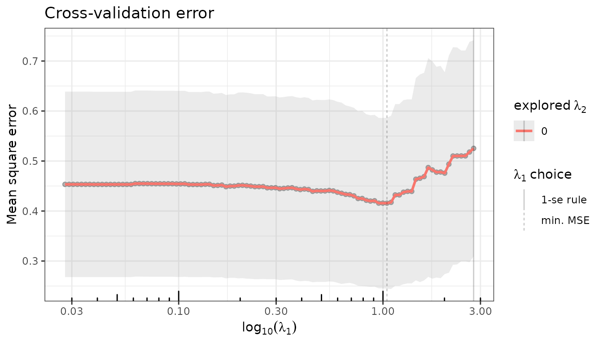

``` r

fit_lasso$debias <- FALSE
fit_lasso$plot_path()
```

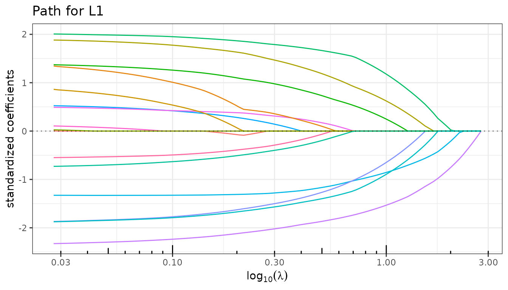

Setting `$debias` back to `FALSE` restores the original regularized
coefficients.
