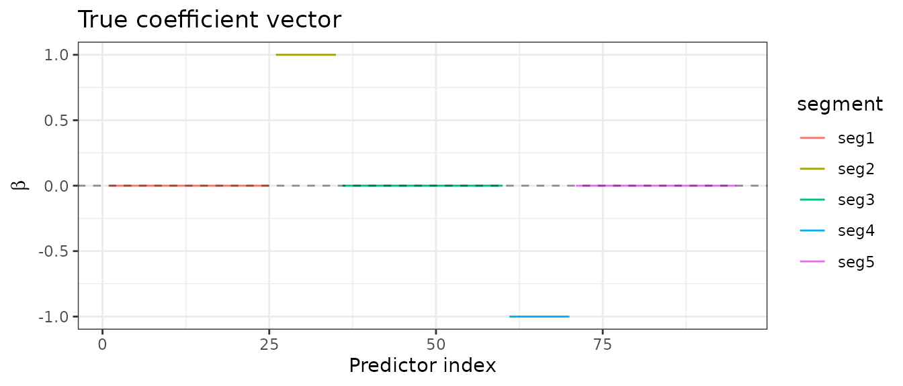
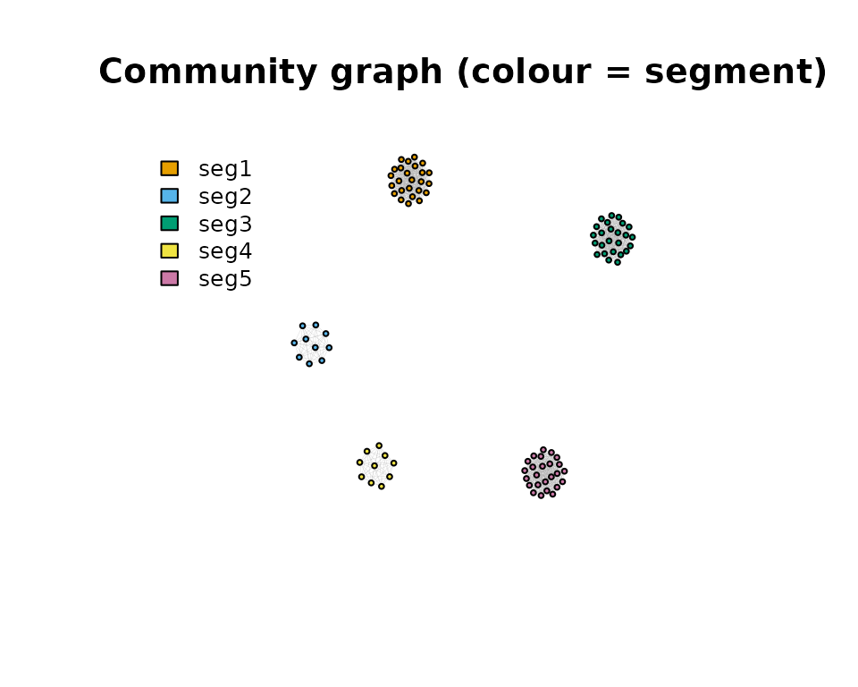
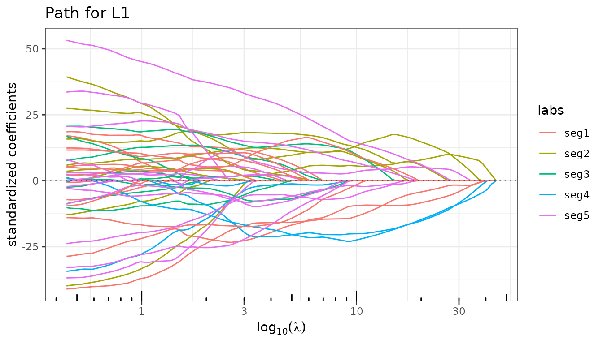
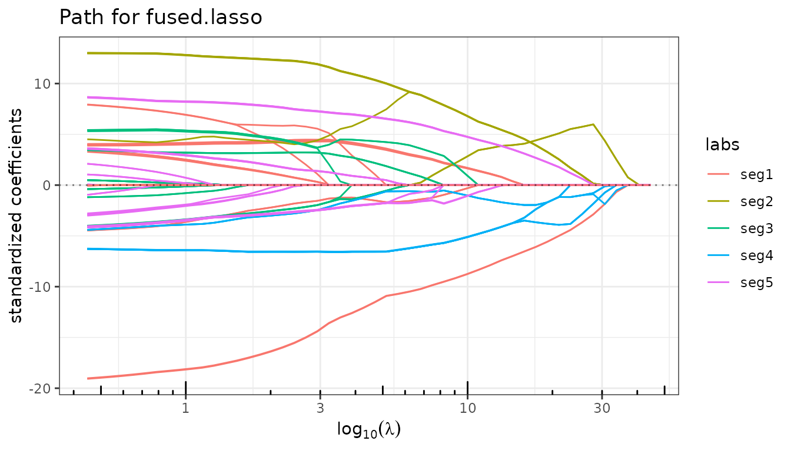
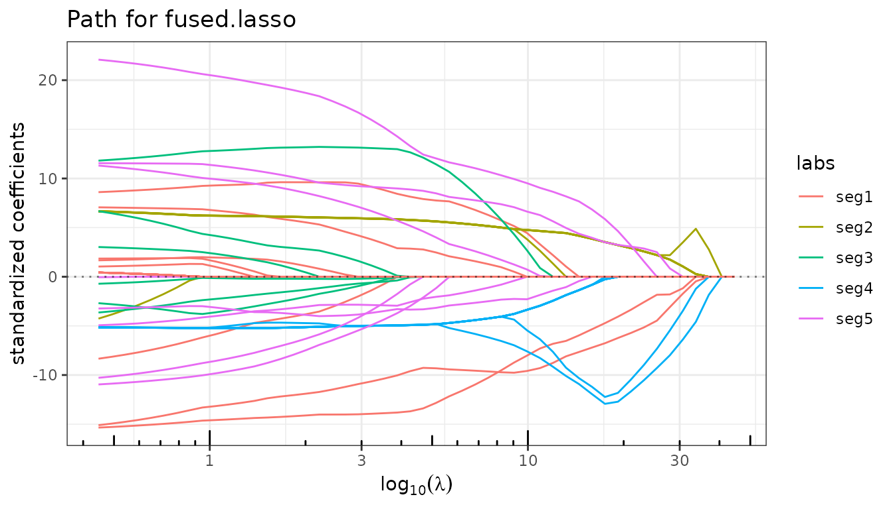
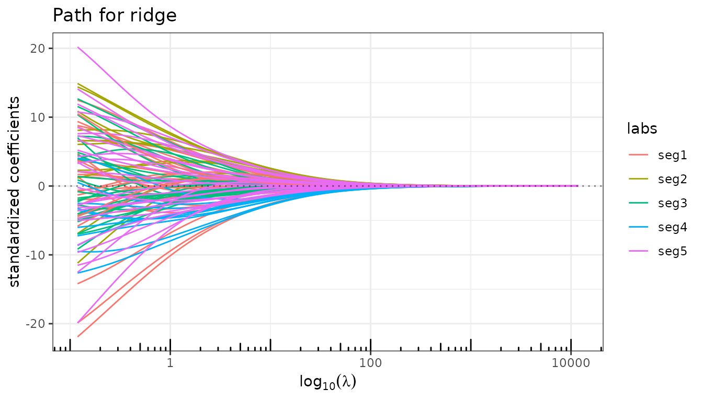
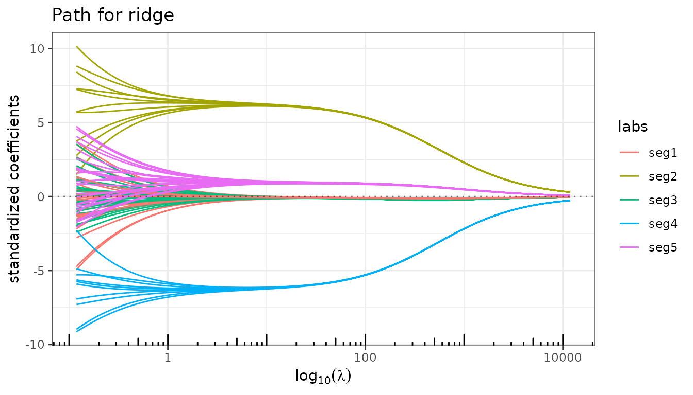
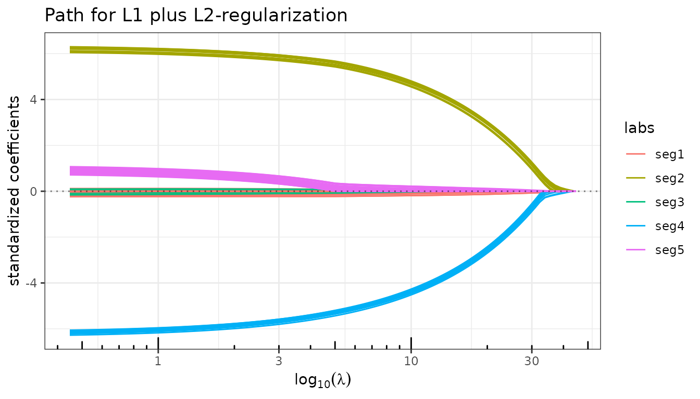
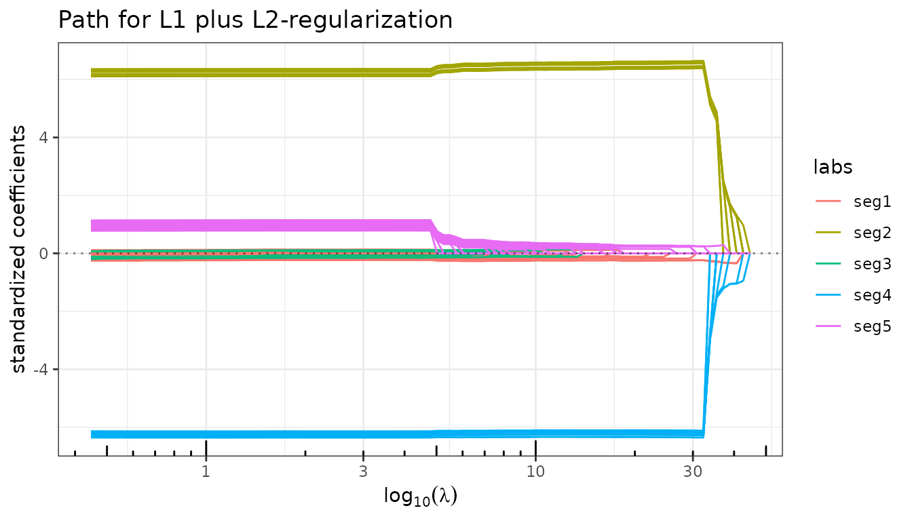
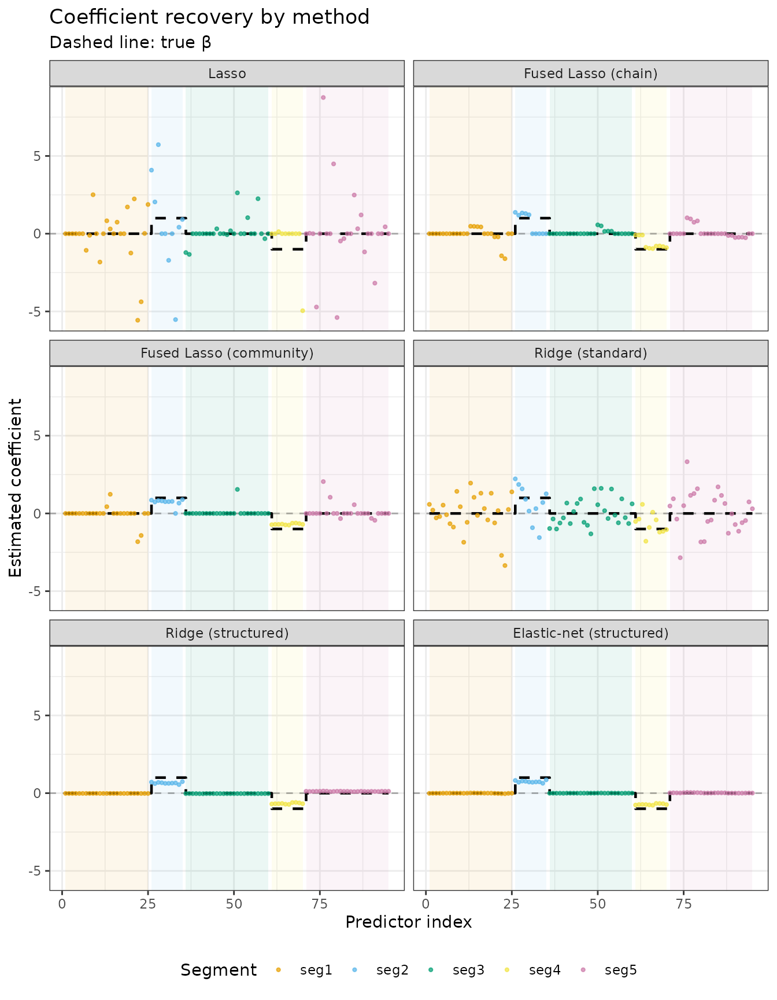

# Recovering a Structured Signal with Quadrupen

## Motivation

Sparse penalties such as the Lasso treat all predictors symmetrically:
coefficients are shrunk independently without any notion of which
predictors are related. In many applications, however, the signal has a
known structure — predictors are grouped, ordered, or connected through
a graph — and penalties that exploit this structure can substantially
improve estimation.

This vignette builds a progressively richer family of penalties on a
single simulation, showing how incorporating structural knowledge step
by step leads to better coefficient recovery.

## Setup

``` r

library(quadrupen)
library(Matrix)
library(ggplot2)
```

### Simulation

We simulate a linear model with \\p = 95\\ predictors and \\n = 50\\
observations. The true coefficient vector \\\beta\\ is **piecewise
constant**: it is zero over three large segments (sizes 25, 25, 25) and
takes values \\+1\\ and \\-1\\ over two smaller active blocks (sizes 10
each).

``` r

set.seed(42)
p    <- 95
n    <- 50
beta <- rep(c(0, 1, 0, -1, 0), c(25, 10, 25, 10, 25))

## Block-correlated predictors: high within-segment, zero across segments
rho <- 0.75
Soo <- toeplitz(rho^(0:24))      # Toeplitz correlation within zero segments
Sww <- matrix(rho, 10, 10)       # constant correlation within active segments
Sigma <- bdiag(Soo, Sww, Soo, Sww, Soo)
diag(Sigma) <- 1

X <- as.matrix(matrix(rnorm(p * n), n, p) %*% chol(Sigma))
y <- X %*% beta + rnorm(n, 0, 10)

## Segment labels (for plot legends)
segments      <- rep(1:5, c(25, 10, 25, 10, 25))
segment_names <- paste0("seg", 1:5)
seg_labels    <- segment_names[segments]
```

The five segments are clearly visible in the true signal:

``` r

data.frame(index = seq_along(beta), beta = beta, segment = seg_labels) |>
  ggplot(aes(x = index, y = beta, colour = segment)) +
  geom_step() + geom_hline(yintercept = 0, linetype = "dashed", alpha = 0.4) +
  labs(x = "Predictor index", y = expression(beta), title = "True coefficient vector") +
  theme_bw()
```



### Community graph and its Laplacian

The structural prior we wish to encode is: *predictors within the same
segment should have similar coefficients*. This is captured by a
**community graph** whose edges connect all pairs of predictors
belonging to the same segment (a union of disjoint cliques).

``` r

## Adjacency matrix: clique within each segment, no edges across
Ioo <- matrix(1, 25, 25)
Iww <- matrix(1, 10, 10)
A   <- as.matrix(bdiag(Ioo, Iww, Ioo, Iww, Ioo))
diag(A) <- 0

## Graph Laplacian: L = D - A  (regularized for positive definiteness)
L2        <- -A
diag(L2)  <- colSums(A) + 1e-2
```

The Laplacian \\L_2\\ defines the quadratic form

\\\beta^\top L_2\\ \beta = \sum\_{(i,j)\in E} (\beta_i - \beta_j)^2,\\

which penalizes *differences between connected predictors*. Adding
\\\lambda_2 \beta^\top L_2 \beta / 2\\ to the loss therefore encourages
within-segment coefficients to be equal — a perfect match for the
piecewise-constant signal. Note that \\L_2\\ is passed as the `struct`
argument to
[`ridge()`](https://jchiquet.github.io/quadrupen/reference/ridge.md) and
[`elastic_net()`](https://jchiquet.github.io/quadrupen/reference/sparse_lm.md).

For the Fused Lasso, the graph structure is encoded differently:
`struct` takes the **adjacency matrix** \\A\\ directly, since the fusion
penalty is

\\\lambda_2 \sum\_{(i,j)\in E} \|\beta_i - \beta_j\|,\\

an \\\ell_1\\ (not \\\ell_2\\) penalty on pairwise differences. The
graph topology is the same, but the penalty form differs.

``` r

if (requireNamespace("igraph", quietly = TRUE)) {
  g  <- igraph::graph_from_adjacency_matrix(A, mode = "undirected")
  cols <- c("#E69F00", "#56B4E9", "#009E73", "#F0E442", "#CC79A7")
  vertex_colors <- cols[segments]
  igraph::plot.igraph(
    g, vertex.color = vertex_colors, vertex.size = 3,
    vertex.label = NA, edge.width = 0.1,
    main = "Community graph (colour = segment)"
  )
  legend("topleft", legend = segment_names, fill = cols, bty = "n", cex = 0.8)
}
```



------------------------------------------------------------------------

## Lasso: a baseline without structural knowledge

The Lasso applies an element-wise \\\ell_1\\ penalty and treats all
predictors independently. With highly correlated predictors it tends to
select one representative per block arbitrarily, producing an erratic
path.

``` r

fit_lasso <- lasso(X, y, intercept = FALSE)
fit_lasso
#> Linear regression with L1  penalizer.
#> - number of coefficients: 95 + intercept
#> - lambda regularization: 100 points from 44.7 to 0.447
#> - gamma regularization: 0
```

``` r

fit_lasso$plot_path(labels = seg_labels)
```



------------------------------------------------------------------------

## Fused Lasso: penalizing differences between consecutive predictors

The Fused Lasso adds an \\\ell_1\\ penalty on *differences between
adjacent coefficients* on top of the standard \\\ell_1\\ penalty:

\\\min\_\beta \frac{1}{2}\\y - X\beta\\^2 + \lambda_1 \\\beta\\\_1 +
\lambda_2 \sum\_{i=1}^{p-1} \|\beta\_{i+1} - \beta_i\|.\\

By default,
[`fused_lasso()`](https://jchiquet.github.io/quadrupen/reference/fused_lasso.md)
uses a **chain graph** (consecutive pairs), which is appropriate for
ordered or spatial signals.

``` r

fit_fused_chain <- fused_lasso(X, y, lambda2 = 5, intercept = FALSE)
fit_fused_chain
#> Linear regression with fused.lasso penalizer.
#> - number of coefficients: 95 + intercept
#> - l1 regularization: 50 points from 44.7 to 0.447
#> - l2 regularization: 5
```

``` r

fit_fused_chain$plot_path(labels = seg_labels)
```



### Fused Lasso with the community graph

Replacing the chain by the community adjacency matrix \\A\\ fuses
predictors *within the same segment* rather than consecutive ones. This
directly targets the true block structure of \\\beta\\.

``` r

fit_fused_comm <- fused_lasso(X, y, lambda2 = 5, struct = A, intercept = FALSE)
fit_fused_comm
#> Linear regression with fused.lasso penalizer.
#> - number of coefficients: 95 + intercept
#> - l1 regularization: 50 points from 44.7 to 0.447
#> - l2 regularization: 5
```

``` r

fit_fused_comm$plot_path(labels = seg_labels)
```



------------------------------------------------------------------------

## Structured Ridge: shrinking toward block-constant solutions

The standard ridge regression shrinks all coefficients toward **zero**.
The structured ridge replaces the identity by a positive semidefinite
matrix \\S\\:

\\\min\_\beta \frac{1}{2}\\y - X\beta\\^2 + \frac{\lambda_2}{2}\\
\beta^\top S\\ \beta.\\

With \\S = L_2\\ (the community Laplacian), the penalty becomes
\\\frac{\lambda_2}{2}\beta^\top L_2 \beta\\, which shrinks
*within-segment differences* rather than the coefficients themselves.

### Standard ridge

``` r

fit_ridge_std <- ridge(X, y, intercept = FALSE)
fit_ridge_std$plot_path(labels = seg_labels)
```



The path is a blur: all predictors are shrunk toward zero with no
differentiation between segments.

### Structured ridge (\\S = L_2\\)

``` r

fit_ridge_struct <- ridge(X, y, struct = L2, lambda_max = 1000, intercept = FALSE)
fit_ridge_struct$plot_path(labels = seg_labels)
```



The Laplacian prior forces coefficients within the same segment to track
each other. The two active segments (2 and 4) now emerge as coherent
bundles.

------------------------------------------------------------------------

## Structured Elastic-net: sparsity + graph-Laplacian regularization

The Elastic-net combines an \\\ell_1\\ penalty with a quadratic penalty:

\\\min\_\beta \frac{1}{2}\\y - X\beta\\^2 + \lambda_1\\\beta\\\_1 +
\frac{\lambda_2}{2}\\ \beta^\top S\\ \beta.\\

Setting \\S = L_2\\ yields the **structured Elastic-net**: the
\\\ell_1\\ term drives entire segments to zero (sparsity at the segment
level), while the Laplacian term forces the non-zero segments to be
internally smooth.

``` r

fit_enet_struct <- elastic_net(X, y, lambda2 = 5, struct = L2, intercept = FALSE)
fit_enet_struct
#> Linear regression with L1 plus L2-regularization penalizer.
#> - number of coefficients: 95 + intercept
#> - lambda regularization: 100 points from 44.7 to 0.447
#> - gamma regularization: 5
```

``` r

fit_enet_struct$plot_path(labels = seg_labels)
```



The two active segments now enter the path as well-separated,
near-constant bundles while the three zero segments stay at zero.

### Debiased structured Elastic-net

The \\\ell_1\\ penalty introduces shrinkage bias. Refitting the model on
the selected support without penalization recovers near-unbiased
estimates.

``` r

fit_enet_struct$debias <- TRUE
fit_enet_struct$plot_path(labels = seg_labels)
```



``` r

fit_enet_struct$debias <- FALSE
```

------------------------------------------------------------------------

## Coefficient recovery: a side-by-side comparison

We extract the BIC-selected coefficient vector for each method and
compare visually against the true \\\beta\\.

``` r

methods <- list(
  "Lasso"                  = fit_lasso,
  "Fused Lasso (chain)"    = fit_fused_chain,
  "Fused Lasso (community)"= fit_fused_comm,
  "Ridge (standard)"       = fit_ridge_std,
  "Ridge (structured)"     = fit_ridge_struct,
  "Elastic-net (structured)"= fit_enet_struct
)

extract_coef <- function(fit) {
  b <- fit$get_model("BIC")
  if ("Intercept" %in% names(b)) b <- b[-1]   # drop intercept
  b
}

df_coef <- do.call(rbind, lapply(names(methods), function(nm) {
  b <- extract_coef(methods[[nm]])
  data.frame(
    method  = factor(nm, levels = names(methods)),
    index   = seq_along(b),
    value   = as.numeric(b),
    segment = seg_labels
  )
}))

df_true <- data.frame(
  index   = seq_along(beta),
  beta    = beta,
  segment = seg_labels
)
```

``` r

## Background shading for each segment
seg_bounds <- data.frame(
  xmin = c(1, 26, 36, 61, 71),
  xmax = c(25, 35, 60, 70, 95),
  fill = factor(1:5)
)

ggplot(df_coef, aes(x = index, y = value)) +
  geom_rect(data = seg_bounds,
            aes(xmin = xmin, xmax = xmax, ymin = -Inf, ymax = Inf, fill = fill),
            alpha = 0.08, inherit.aes = FALSE) +
  scale_fill_manual(values = c("#E69F00","#56B4E9","#009E73","#F0E442","#CC79A7"),
                    guide = "none") +
  geom_hline(yintercept = 0, linetype = "dashed", alpha = 0.3) +
  geom_step(data = df_true, aes(y = beta), colour = "black", linewidth = 0.8,
            linetype = "dashed") +
  geom_point(aes(colour = segment), size = 0.8, alpha = 0.7) +
  scale_colour_manual(values = c("#E69F00","#56B4E9","#009E73","#F0E442","#CC79A7")) +
  facet_wrap(~ method, ncol = 2) +
  labs(x = "Predictor index", y = "Estimated coefficient",
       title = "Coefficient recovery by method",
       subtitle = "Dashed line: true β",
       colour = "Segment") +
  theme_bw() +
  theme(legend.position = "bottom")
```



The progression illustrates the benefit of structural priors:

- **Lasso**: selects a few predictors erratically within the active
  segments.
- **Fused Lasso (chain)**: smoother path, but the chain graph blurs
  transitions between segments rather than reinforcing block structure.
- **Fused Lasso (community)**: within-segment fusion correctly pools the
  active blocks, but the \\\ell_1\\ fusion penalty may still miss some
  predictors.
- **Ridge (standard)**: all coefficients shrunk toward zero; the block
  pattern is not recovered.
- **Ridge (structured)**: within-segment coefficients cluster together;
  the active segments are identifiable but not zeroed out.
- **Elastic-net (structured)**: sparsity zeros out the inactive segments
  while the Laplacian smooths the active ones — the closest recovery to
  the true signal.
